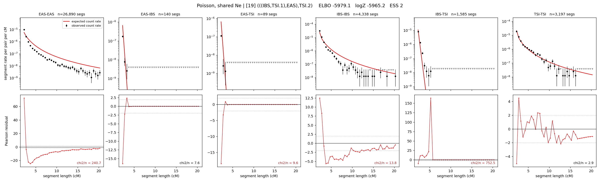

# `(((IBS,TSI.1),EAS),TSI.2)`

**Poisson, shared Ne** | topology 19 of 21 | admixed leaf: **TSI** | 4 events, 8 nodes

## Model score

| quantity | value | |
|---|---|---|
| ELBO | -5979.11 | +- 0.20 (MC) |
| logZ (importance sampling) | -5965.15 | |
| ESS of the IS weights | 2.3 / 4000 | LOW -- treat logZ with suspicion |
| Stan dropped-constant correction | -24.10 | already applied |
| seed kept / runtime | 1 | 18 s |

## Events (in temporal order, most recent first)

| # | type | detail | time (gen) | cumulative |
|---|---|---|---|---|
| 1 | ADMIXTURE | TSI -> TSI.1 + TSI.2 | 1.0 +- 0.0 | 1.0 |
| 2 | MERGE | TSI.2 + IBS -> n1 | 254.5 +- 0.6 | 255.5 |
| 3 | MERGE | n1 + EAS -> n2 | 75.4 +- 0.8 | 330.9 |
| 4 | MERGE | TSI.1 + n2 -> root | 2.8 +- 0.0 | 333.7 |

## Admixture fraction

**f = 0.000 +- 0.000** (fraction from `TSI.1`; 1.000 from `TSI.2`)

Collapsed to a tree: one source carries <5% of the ancestry, so this graph is behaving as its no-admixture special case.

## Effective sizes shared by IBD and SNP (haploid)

| node | Ne | sd of log Ne |
|---|---|---|
| `EAS` | 891,846 | 0.02 |
| `IBS` | 314,835 | 0.06 |
| `TSI` | 427,643 | 0.02 |
| `TSI.1` | 0 | 0.15 |
| `TSI.2` | 418,487 | 0.02 |
| `n1` | 418 | 0.01 |
| `n2` | 618 | 0.01 |
| `root` | 428 | 0.00 |

log-Ne random-walk step scale tau = 1.270

## Fit quality by component

| component | log-likelihood | n terms | chi2/n |
|---|---|---|---|
| IBD | -5,811.1 | 222 | 171.68 |
| SNP | +39.3 | 6 | 1.45 |

IBD chi2/n uses Poisson counting variance; SNP chi2/n uses its block SEs. Values near 1 indicate residuals on the modeled noise scale.

## SNP covariance residuals `(w_hat - W_pred)/w_se`

| | EAS | IBS | TSI |
|---|---|---|---|
| **EAS** | -0.07 | -0.24 | +0.38 |
| **IBS** | -0.24 | +0.95 | -0.53 |
| **TSI** | +0.38 | -0.53 | -0.22 |

