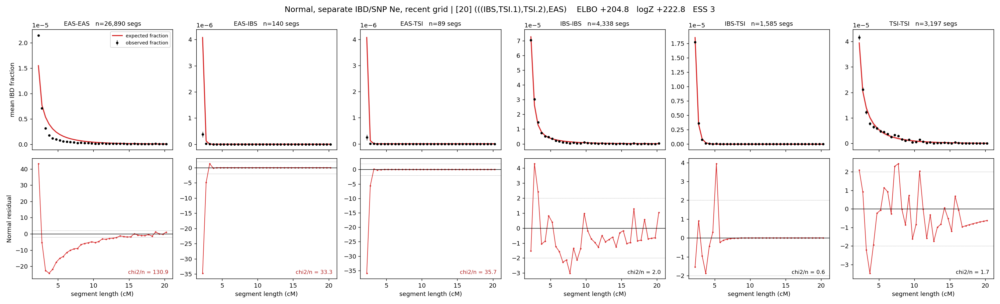

# `(((IBS,TSI.1),TSI.2),EAS)`

**Normal, separate IBD/SNP Ne, recent grid** | topology 20 of 21 | admixed leaf: **TSI** | 4 events, 8 nodes

> Recent Ne grid: 0-5 and 5-10 generations. The first demographic event is explicitly constrained to occur after generation 10 (minimum 11 with the current one-generation gap).

## Model score

| quantity | value | |
|---|---|---|
| ELBO | +204.80 | +- 0.20 (MC) |
| logZ (importance sampling) | +222.79 | |
| ESS of the IS weights | 2.9 / 4000 | LOW -- treat logZ with suspicion |
| Stan dropped-constant correction | -40.81 | already applied |
| seed kept / runtime | 7 | 23 s |

## Events (in temporal order, most recent first)

| # | type | detail | time (gen) | cumulative |
|---|---|---|---|---|
| 1 | ADMIXTURE | TSI -> TSI.1 + TSI.2 | 11.4 +- 0.0 | 11.4 |
| 2 | MERGE | TSI.2 + IBS -> n1 | 108.9 +- 0.2 | 120.3 |
| 3 | MERGE | TSI.1 + n1 -> n2 | 156.2 +- 0.3 | 276.5 |
| 4 | MERGE | n2 + EAS -> root | 83.4 +- 0.3 | 360.0 |

## Admixture fraction

**f = 0.769 +- 0.001** (fraction from `TSI.1`; 0.231 from `TSI.2`)

## Recent effective sizes for IBD (haploid)

| population | 0-5 gen | 5-10 gen |
|---|---:|---:|
| `EAS` | 65,444,325 | 32,185,278 |
| `IBS` | 3,055,629 | 2,138,784 |
| `TSI` | 3,302,208 | 2,527,056 |

## Effective sizes for IBD (haploid)

| node | Ne | sd of log Ne |
|---|---|---|
| `EAS` | 868,982 | 0.02 |
| `IBS` | 504,120 | 0.04 |
| `TSI` | 1,082,518 | 0.04 |
| `TSI.1` | 199,551 | 0.04 |
| `TSI.2` | 45,191,488 | 0.04 |
| `n1` | 20,876 | 0.03 |
| `n2` | 1,185 | 0.02 |
| `root` | 28 | 0.01 |

log-Ne random-walk step scale tau_ibd = 2.609

## Recent effective sizes for SNP (haploid)

| population | 0-5 gen | 5-10 gen |
|---|---:|---:|
| `EAS` | 211,928 | 161,703 |
| `IBS` | 442,486 | 402,882 |
| `TSI` | 269,379 | 251,520 |

## Effective sizes for SNP (haploid)

| node | Ne | sd of log Ne |
|---|---|---|
| `EAS` | 54,923 | 0.01 |
| `IBS` | 282,423 | 0.03 |
| `TSI` | 201,401 | 0.02 |
| `TSI.1` | 96,234 | 0.03 |
| `TSI.2` | 1,201,014 | 0.03 |
| `n1` | 78,364 | 0.03 |
| `n2` | 482 | 0.01 |
| `root` | 4,222 | 0.00 |

log-Ne random-walk step scale tau_snp = 1.366

## Fit quality by component

| component | log-likelihood | n terms | chi2/n |
|---|---|---|---|
| IBD | +562.8 | 222 | 34.14 |
| SNP | +40.0 | 6 | 1.22 |

IBD chi2/n uses Palamara model-derived Normal variance; SNP chi2/n uses its block SEs. Values near 1 indicate residuals on the modeled noise scale.

## SNP covariance residuals `(w_hat - W_pred)/w_se`

| | EAS | IBS | TSI |
|---|---|---|---|
| **EAS** | +0.10 | +0.27 | -0.46 |
| **IBS** | +0.27 | -1.37 | +0.93 |
| **TSI** | -0.46 | +0.93 | +0.00 |

