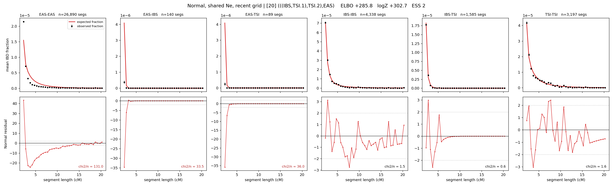

# `(((IBS,TSI.1),TSI.2),EAS)`

**Normal, shared Ne, recent grid** | topology 20 of 21 | admixed leaf: **TSI** | 4 events, 8 nodes

> Recent Ne grid: 0-5 and 5-10 generations. The first demographic event is explicitly constrained to occur after generation 10 (minimum 11 with the current one-generation gap).

## Model score

| quantity | value | |
|---|---|---|
| ELBO | +285.76 | +- 0.22 (MC) |
| logZ (importance sampling) | +302.66 | |
| ESS of the IS weights | 2.2 / 4000 | LOW -- treat logZ with suspicion |
| Stan dropped-constant correction | -29.61 | already applied |
| mode kept / MAP start / runtime | 2 / 0 | 27 s |
| mode search | 12/12 MAP starts succeeded | 3 distinct modes evaluated |

## Events (in temporal order, most recent first)

| # | type | detail | time (gen) | cumulative |
|---|---|---|---|---|
| 1 | ADMIXTURE | TSI -> TSI.1 + TSI.2 | 11.2 +- 0.0 | 11.2 |
| 2 | MERGE | TSI.2 + IBS -> n1 | 81.3 +- 0.3 | 92.5 |
| 3 | MERGE | TSI.1 + n1 -> n2 | 210.5 +- 0.8 | 303.0 |
| 4 | MERGE | n2 + EAS -> root | 17.2 +- 0.1 | 320.2 |

## Admixture fraction

**f = 0.857 +- 0.002** (fraction from `TSI.1`; 0.143 from `TSI.2`)

## Recent effective sizes shared by IBD and SNP (haploid)

| population | 0-5 gen | 5-10 gen |
|---|---:|---:|
| `EAS` | 73,967,576 | 34,947,983 |
| `IBS` | 2,056,845 | 1,587,299 |
| `TSI` | 1,720,962 | 1,423,595 |

## Effective sizes shared by IBD and SNP (haploid)

| node | Ne | sd of log Ne |
|---|---|---|
| `EAS` | 869,586 | 0.02 |
| `IBS` | 593,926 | 0.13 |
| `TSI` | 769,661 | 0.03 |
| `TSI.1` | 257,940 | 0.03 |
| `TSI.2` | 33,354,083 | 0.03 |
| `n1` | 48,410 | 0.03 |
| `n2` | 96 | 0.01 |
| `root` | 212 | 0.01 |

log-Ne random-walk step scale tau = 2.231

## Fit quality by component

| component | log-likelihood | n terms | chi2/n |
|---|---|---|---|
| IBD | +516.7 | 222 | 34.12 |
| SNP | +20.6 | 6 | 7.66 |

IBD chi2/n uses Palamara model-derived Normal variance; SNP chi2/n uses its block SEs. Values near 1 indicate residuals on the modeled noise scale.

## SNP covariance residuals `(w_hat - W_pred)/w_se`

| | EAS | IBS | TSI |
|---|---|---|---|
| **EAS** | +0.22 | +1.56 | -2.01 |
| **IBS** | +1.56 | -5.19 | +2.39 |
| **TSI** | -2.01 | +2.39 | +1.59 |

