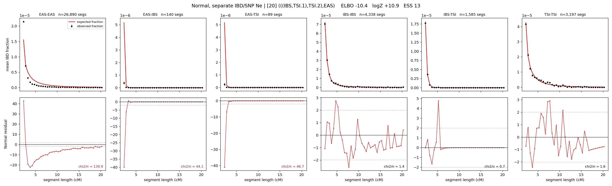

# `(((IBS,TSI.1),TSI.2),EAS)`

**Normal, separate IBD/SNP Ne** | topology 20 of 21 | admixed leaf: **TSI** | 4 events, 8 nodes

## Model score

| quantity | value | |
|---|---|---|
| ELBO | -10.45 | +- 0.34 (MC) |
| logZ (importance sampling) | +10.93 | |
| ESS of the IS weights | 13.5 / 4000 | LOW -- treat logZ with suspicion |
| Stan dropped-constant correction | -29.78 | already applied |
| mode kept / MAP start / runtime | 1 / 7 | 23 s |
| mode search | 12/12 MAP starts succeeded | 3 distinct modes evaluated |

## Events (in temporal order, most recent first)

| # | type | detail | time (gen) | cumulative |
|---|---|---|---|---|
| 1 | ADMIXTURE | TSI -> TSI.1 + TSI.2 | 13.5 +- 0.1 | 13.5 |
| 2 | MERGE | TSI.2 + IBS -> n1 | 84.6 +- 1.7 | 98.1 |
| 3 | MERGE | TSI.1 + n1 -> n2 | 30.4 +- 0.5 | 128.4 |
| 4 | MERGE | n2 + EAS -> root | 219.6 +- 2.5 | 348.0 |

## Admixture fraction

**f = 1.000 +- 0.000** (fraction from `TSI.1`; 0.000 from `TSI.2`)

Collapsed to a tree: one source carries <5% of the ancestry, so this graph is behaving as its no-admixture special case.

## Effective sizes for IBD (haploid)

| node | Ne | sd of log Ne |
|---|---|---|
| `EAS` | 968,132 | 0.06 |
| `IBS` | 732,075 | 0.05 |
| `TSI` | 956,325 | 0.07 |
| `TSI.1` | 368,733 | 0.05 |
| `TSI.2` | 30,949 | 0.03 |
| `n1` | 26,254 | 0.03 |
| `n2` | 61,460 | 0.04 |
| `root` | 41 | 0.02 |

log-Ne random-walk step scale tau_ibd = 1.605

## Effective sizes for SNP (haploid)

| node | Ne | sd of log Ne |
|---|---|---|
| `EAS` | 1,969 | 0.01 |
| `IBS` | 102,594 | 0.03 |
| `TSI` | 85,069 | 0.03 |
| `TSI.1` | 90,146 | 0.03 |
| `TSI.2` | 84,622 | 0.03 |
| `n1` | 79,756 | 0.03 |
| `n2` | 60,778 | 0.03 |
| `root` | 10,490 | 0.01 |

log-Ne random-walk step scale tau_snp = 0.583

## Fit quality by component

| component | log-likelihood | n terms | chi2/n |
|---|---|---|---|
| IBD | +159.4 | 222 | 37.69 |
| SNP | +42.0 | 6 | 0.52 |

IBD chi2/n uses Palamara model-derived Normal variance; SNP chi2/n uses its block SEs. Values near 1 indicate residuals on the modeled noise scale.

## SNP covariance residuals `(w_hat - W_pred)/w_se`

| | EAS | IBS | TSI |
|---|---|---|---|
| **EAS** | +0.02 | -0.00 | -0.04 |
| **IBS** | -0.00 | -0.09 | +0.10 |
| **TSI** | -0.04 | +0.10 | -0.03 |

