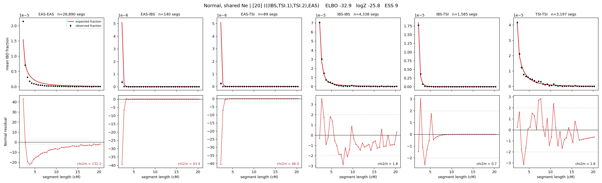

# `(((IBS,TSI.1),TSI.2),EAS)`

**Normal, shared Ne** | topology 20 of 21 | admixed leaf: **TSI** | 4 events, 8 nodes

## Model score

| quantity | value | |
|---|---|---|
| ELBO | -32.86 | +- 0.08 (MC) |
| logZ (importance sampling) | -25.79 | |
| ESS of the IS weights | 8.6 / 4000 | LOW -- treat logZ with suspicion |
| Stan dropped-constant correction | -24.10 | already applied |
| mode kept / MAP start / runtime | 1 / 6 | 19 s |
| mode search | 12/12 MAP starts succeeded | 3 distinct modes evaluated |

## Events (in temporal order, most recent first)

| # | type | detail | time (gen) | cumulative |
|---|---|---|---|---|
| 1 | ADMIXTURE | TSI -> TSI.1 + TSI.2 | 13.4 +- 0.1 | 13.4 |
| 2 | MERGE | TSI.2 + IBS -> n1 | 79.1 +- 0.7 | 92.5 |
| 3 | MERGE | TSI.1 + n1 -> n2 | 206.8 +- 0.7 | 299.4 |
| 4 | MERGE | n2 + EAS -> root | 31.0 +- 0.1 | 330.3 |

## Admixture fraction

**f = 0.860 +- 0.002** (fraction from `TSI.1`; 0.140 from `TSI.2`)

## Effective sizes shared by IBD and SNP (haploid)

| node | Ne | sd of log Ne |
|---|---|---|
| `EAS` | 965,385 | 0.01 |
| `IBS` | 640,020 | 0.06 |
| `TSI` | 1,546,121 | 0.02 |
| `TSI.1` | 274,895 | 0.02 |
| `TSI.2` | 70,683 | 0.03 |
| `n1` | 47,408 | 0.03 |
| `n2` | 173 | 0.01 |
| `root` | 105 | 0.01 |

log-Ne random-walk step scale tau = 1.957

## Fit quality by component

| component | log-likelihood | n terms | chi2/n |
|---|---|---|---|
| IBD | +114.2 | 222 | 37.66 |
| SNP | +20.0 | 6 | 7.87 |

IBD chi2/n uses Palamara model-derived Normal variance; SNP chi2/n uses its block SEs. Values near 1 indicate residuals on the modeled noise scale.

## SNP covariance residuals `(w_hat - W_pred)/w_se`

| | EAS | IBS | TSI |
|---|---|---|---|
| **EAS** | +0.26 | +1.54 | -2.07 |
| **IBS** | +1.54 | -5.19 | +2.41 |
| **TSI** | -2.07 | +2.41 | +1.69 |

