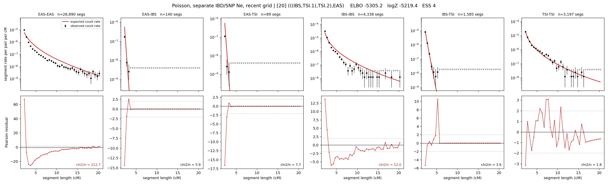

# `(((IBS,TSI.1),TSI.2),EAS)`

**Poisson, separate IBD/SNP Ne, recent grid** | topology 20 of 21 | admixed leaf: **TSI** | 4 events, 8 nodes

> Recent Ne grid: 0-5 and 5-10 generations. The first demographic event is explicitly constrained to occur after generation 10 (minimum 11 with the current one-generation gap).

## Model score

| quantity | value | |
|---|---|---|
| ELBO | -5305.16 | +- 1.19 (MC) |
| logZ (importance sampling) | -5219.37 | |
| ESS of the IS weights | 4.0 / 4000 | LOW -- treat logZ with suspicion |
| Stan dropped-constant correction | -40.81 | already applied |
| seed kept / runtime | 7 | 22 s |

## Events (in temporal order, most recent first)

| # | type | detail | time (gen) | cumulative |
|---|---|---|---|---|
| 1 | ADMIXTURE | TSI -> TSI.1 + TSI.2 | 11.0 +- 0.0 | 11.0 |
| 2 | MERGE | TSI.2 + IBS -> n1 | 148.4 +- 2.3 | 159.4 |
| 3 | MERGE | TSI.1 + n1 -> n2 | 1.0 +- 0.0 | 160.4 |
| 4 | MERGE | n2 + EAS -> root | 173.9 +- 27.1 | 334.3 |

## Admixture fraction

**f = 0.901 +- 0.014** (fraction from `TSI.1`; 0.099 from `TSI.2`)

## Recent effective sizes for IBD (haploid)

| population | 0-5 gen | 5-10 gen |
|---|---:|---:|
| `EAS` | 58,558,695 | 33,225,208 |
| `IBS` | 4,198,607 | 2,778,255 |
| `TSI` | 2,550,021 | 2,199,900 |

## Effective sizes for IBD (haploid)

| node | Ne | sd of log Ne |
|---|---|---|
| `EAS` | 833,124 | 0.03 |
| `IBS` | 297,848 | 0.09 |
| `TSI` | 1,759,414 | 0.23 |
| `TSI.1` | 3,112,018 | 0.25 |
| `TSI.2` | 4,383 | 0.30 |
| `n1` | 10,667 | 0.12 |
| `n2` | 14,428 | 0.08 |
| `root` | 770 | 1.05 |

log-Ne random-walk step scale tau_ibd = 2.495

## Recent effective sizes for SNP (haploid)

| population | 0-5 gen | 5-10 gen |
|---|---:|---:|
| `EAS` | 34,771 | 29,040 |
| `IBS` | 297,988 | 269,693 |
| `TSI` | 83,606 | 82,276 |

## Effective sizes for SNP (haploid)

| node | Ne | sd of log Ne |
|---|---|---|
| `EAS` | 11,890 | 1.11 |
| `IBS` | 170,164 | 0.56 |
| `TSI` | 79,468 | 0.11 |
| `TSI.1` | 95,842 | 0.11 |
| `TSI.2` | 10,831 | 0.19 |
| `n1` | 3,611 | 0.89 |
| `n2` | 3,423 | 0.92 |
| `root` | 11,644 | 0.28 |

log-Ne random-walk step scale tau_snp = 1.102

## Fit quality by component

| component | log-likelihood | n terms | chi2/n |
|---|---|---|---|
| IBD | -4,989.6 | 222 | 41.18 |
| SNP | +28.4 | 6 | 5.08 |

IBD chi2/n uses Poisson counting variance; SNP chi2/n uses its block SEs. Values near 1 indicate residuals on the modeled noise scale.

## SNP covariance residuals `(w_hat - W_pred)/w_se`

| | EAS | IBS | TSI |
|---|---|---|---|
| **EAS** | +0.07 | +0.11 | -0.26 |
| **IBS** | +0.11 | -1.03 | +0.87 |
| **TSI** | -0.26 | +0.87 | -0.32 |

