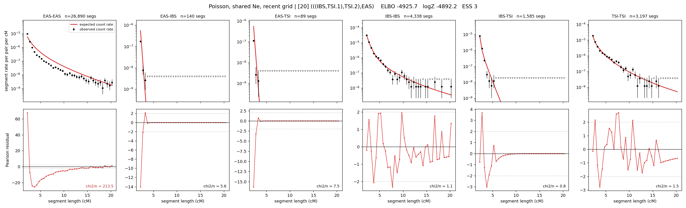

# `(((IBS,TSI.1),TSI.2),EAS)`

**Poisson, shared Ne, recent grid** | topology 20 of 21 | admixed leaf: **TSI** | 4 events, 8 nodes

> Recent Ne grid: 0-5 and 5-10 generations. The first demographic event is explicitly constrained to occur after generation 10 (minimum 11 with the current one-generation gap).

## Model score

| quantity | value | |
|---|---|---|
| ELBO | -4925.72 | +- 0.59 (MC) |
| logZ (importance sampling) | -4892.15 | |
| ESS of the IS weights | 3.5 / 4000 | LOW -- treat logZ with suspicion |
| Stan dropped-constant correction | -29.61 | already applied |
| mode kept / MAP start / runtime | 1 / 3 | 28 s |
| mode search | 12/12 MAP starts succeeded | 3 distinct modes evaluated |

## Events (in temporal order, most recent first)

| # | type | detail | time (gen) | cumulative |
|---|---|---|---|---|
| 1 | ADMIXTURE | TSI -> TSI.1 + TSI.2 | 11.7 +- 0.0 | 11.7 |
| 2 | MERGE | TSI.2 + IBS -> n1 | 63.2 +- 0.7 | 74.8 |
| 3 | MERGE | TSI.1 + n1 -> n2 | 213.1 +- 1.4 | 287.9 |
| 4 | MERGE | n2 + EAS -> root | 27.9 +- 0.4 | 315.8 |

## Admixture fraction

**f = 0.901 +- 0.002** (fraction from `TSI.1`; 0.099 from `TSI.2`)

## Recent effective sizes shared by IBD and SNP (haploid)

| population | 0-5 gen | 5-10 gen |
|---|---:|---:|
| `EAS` | 95,980,142 | 45,169,252 |
| `IBS` | 4,404,597 | 2,617,365 |
| `TSI` | 2,455,923 | 1,667,453 |

## Effective sizes shared by IBD and SNP (haploid)

| node | Ne | sd of log Ne |
|---|---|---|
| `EAS` | 832,271 | 0.03 |
| `IBS` | 724,459 | 0.17 |
| `TSI` | 1,392,197 | 0.08 |
| `TSI.1` | 288,186 | 0.06 |
| `TSI.2` | 8,833,153 | 0.11 |
| `n1` | 73,313 | 0.07 |
| `n2` | 155 | 0.01 |
| `root` | 948 | 0.01 |

log-Ne random-walk step scale tau = 2.365

## Fit quality by component

| component | log-likelihood | n terms | chi2/n |
|---|---|---|---|
| IBD | -4,729.3 | 222 | 38.61 |
| SNP | +30.0 | 6 | 4.55 |

IBD chi2/n uses Poisson counting variance; SNP chi2/n uses its block SEs. Values near 1 indicate residuals on the modeled noise scale.

## SNP covariance residuals `(w_hat - W_pred)/w_se`

| | EAS | IBS | TSI |
|---|---|---|---|
| **EAS** | +0.03 | +1.09 | -1.15 |
| **IBS** | +1.09 | -2.85 | +0.82 |
| **TSI** | -1.15 | +0.82 | +1.43 |

