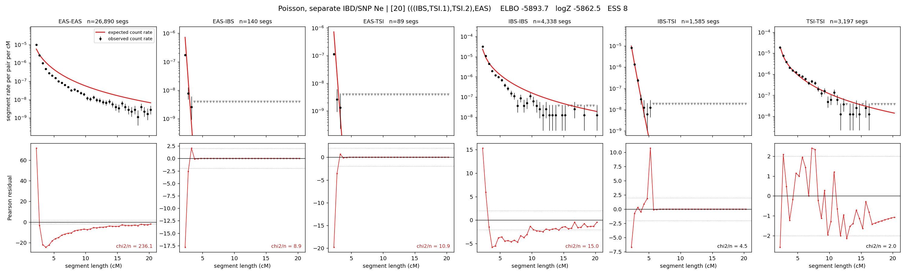

# `(((IBS,TSI.1),TSI.2),EAS)`

**Poisson, separate IBD/SNP Ne** | topology 20 of 21 | admixed leaf: **TSI** | 4 events, 8 nodes

## Model score

| quantity | value | |
|---|---|---|
| ELBO | -5893.69 | +- 0.51 (MC) |
| logZ (importance sampling) | -5862.52 | |
| ESS of the IS weights | 8.1 / 4000 | LOW -- treat logZ with suspicion |
| Stan dropped-constant correction | -29.78 | already applied |
| seed kept / runtime | 7 | 16 s |

## Events (in temporal order, most recent first)

| # | type | detail | time (gen) | cumulative |
|---|---|---|---|---|
| 1 | ADMIXTURE | TSI -> TSI.1 + TSI.2 | 1.0 +- 0.0 | 1.0 |
| 2 | MERGE | TSI.2 + IBS -> n1 | 159.9 +- 1.5 | 160.9 |
| 3 | MERGE | TSI.1 + n1 -> n2 | 1.0 +- 0.0 | 161.9 |
| 4 | MERGE | n2 + EAS -> root | 166.3 +- 1.1 | 328.1 |

## Admixture fraction

**f = 0.002 +- 0.000** (fraction from `TSI.1`; 0.998 from `TSI.2`)

Collapsed to a tree: one source carries <5% of the ancestry, so this graph is behaving as its no-admixture special case.

## Effective sizes for IBD (haploid)

| node | Ne | sd of log Ne |
|---|---|---|
| `EAS` | 897,941 | 0.02 |
| `IBS` | 316,121 | 0.07 |
| `TSI` | 447,048 | 0.08 |
| `TSI.1` | 20,101 | 0.04 |
| `TSI.2` | 423,850 | 0.08 |
| `n1` | 17,025 | 0.05 |
| `n2` | 13,722 | 0.05 |
| `root` | 448 | 0.07 |

log-Ne random-walk step scale tau_ibd = 1.418

## Effective sizes for SNP (haploid)

| node | Ne | sd of log Ne |
|---|---|---|
| `EAS` | 3,355,884 | 0.14 |
| `IBS` | 110,382 | 0.11 |
| `TSI` | 119,903 | 0.09 |
| `TSI.1` | 1,343 | 0.02 |
| `TSI.2` | 114,346 | 0.09 |
| `n1` | 1,165 | 0.01 |
| `n2` | 927 | 0.01 |
| `root` | 28,512 | 0.02 |

log-Ne random-walk step scale tau_snp = 1.375

## Fit quality by component

| component | log-likelihood | n terms | chi2/n |
|---|---|---|---|
| IBD | -5,689.7 | 222 | 46.50 |
| SNP | +41.1 | 6 | 0.85 |

IBD chi2/n uses Poisson counting variance; SNP chi2/n uses its block SEs. Values near 1 indicate residuals on the modeled noise scale.

## SNP covariance residuals `(w_hat - W_pred)/w_se`

| | EAS | IBS | TSI |
|---|---|---|---|
| **EAS** | +0.01 | +0.08 | -0.11 |
| **IBS** | +0.08 | -0.41 | +0.27 |
| **TSI** | -0.11 | +0.27 | -0.05 |

