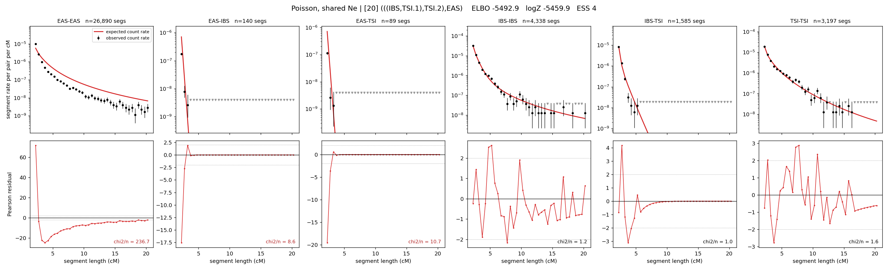

# `(((IBS,TSI.1),TSI.2),EAS)`

**Poisson, shared Ne** | topology 20 of 21 | admixed leaf: **TSI** | 4 events, 8 nodes

## Model score

| quantity | value | |
|---|---|---|
| ELBO | -5492.86 | +- 0.57 (MC) |
| logZ (importance sampling) | -5459.90 | |
| ESS of the IS weights | 3.9 / 4000 | LOW -- treat logZ with suspicion |
| Stan dropped-constant correction | -24.10 | already applied |
| mode kept / MAP start / runtime | 1 / 3 | 17 s |
| mode search | 10/12 MAP starts succeeded | 3 distinct modes evaluated |

## Events (in temporal order, most recent first)

| # | type | detail | time (gen) | cumulative |
|---|---|---|---|---|
| 1 | ADMIXTURE | TSI -> TSI.1 + TSI.2 | 12.3 +- 0.1 | 12.3 |
| 2 | MERGE | TSI.2 + IBS -> n1 | 57.1 +- 0.7 | 69.4 |
| 3 | MERGE | TSI.1 + n1 -> n2 | 213.6 +- 2.9 | 283.0 |
| 4 | MERGE | n2 + EAS -> root | 39.1 +- 0.4 | 322.1 |

## Admixture fraction

**f = 0.915 +- 0.003** (fraction from `TSI.1`; 0.085 from `TSI.2`)

## Effective sizes shared by IBD and SNP (haploid)

| node | Ne | sd of log Ne |
|---|---|---|
| `EAS` | 896,397 | 0.04 |
| `IBS` | 911,094 | 0.11 |
| `TSI` | 2,130,709 | 0.05 |
| `TSI.1` | 293,937 | 0.04 |
| `TSI.2` | 3,186,720 | 0.10 |
| `n1` | 80,361 | 0.06 |
| `n2` | 218 | 0.02 |
| `root` | 577 | 0.02 |

log-Ne random-walk step scale tau = 1.814

## Fit quality by component

| component | log-likelihood | n terms | chi2/n |
|---|---|---|---|
| IBD | -5,373.2 | 222 | 43.56 |
| SNP | +32.5 | 6 | 3.72 |

IBD chi2/n uses Poisson counting variance; SNP chi2/n uses its block SEs. Values near 1 indicate residuals on the modeled noise scale.

## SNP covariance residuals `(w_hat - W_pred)/w_se`

| | EAS | IBS | TSI |
|---|---|---|---|
| **EAS** | +0.05 | +0.95 | -1.05 |
| **IBS** | +0.95 | -2.37 | +0.60 |
| **TSI** | -1.05 | +0.60 | +1.44 |

