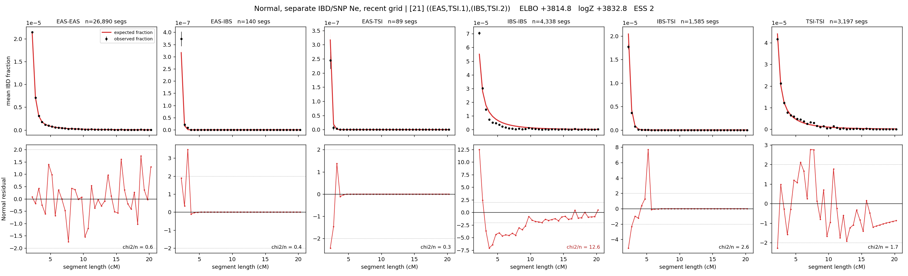

# `((EAS,TSI.1),(IBS,TSI.2))`

**Normal, separate IBD/SNP Ne, recent grid** | topology 21 of 21 | admixed leaf: **TSI** | 4 events, 8 nodes

> Recent Ne grid: 0-5 and 5-10 generations. The first demographic event is explicitly constrained to occur after generation 10 (minimum 11 with the current one-generation gap).

## Model score

| quantity | value | |
|---|---|---|
| ELBO | +3814.80 | +- 0.17 (MC) |
| logZ (importance sampling) | +3832.81 | |
| ESS of the IS weights | 2.4 / 4000 | LOW -- treat logZ with suspicion |
| Stan dropped-constant correction | -40.81 | already applied |
| mode kept / MAP start / runtime | 2 / 11 | 26 s |
| mode search | 12/12 MAP starts succeeded | 3 distinct modes evaluated |

## Events (in temporal order, most recent first)

| # | type | detail | time (gen) | cumulative |
|---|---|---|---|---|
| 1 | ADMIXTURE | TSI -> TSI.1 + TSI.2 | 16.6 +- 0.1 | 16.6 |
| 2 | MERGE | TSI.1 + EAS -> n1 | 114.3 +- 0.3 | 130.9 |
| 3 | MERGE | TSI.2 + IBS -> n2 | 20.1 +- 0.5 | 151.0 |
| 4 | MERGE | n1 + n2 -> root | 130.7 +- 1.3 | 281.8 |

## Admixture fraction

**f = 0.000 +- 0.000** (fraction from `TSI.1`; 1.000 from `TSI.2`)

Collapsed to a tree: one source carries <5% of the ancestry, so this graph is behaving as its no-admixture special case.

## Recent effective sizes for IBD (haploid)

| population | 0-5 gen | 5-10 gen |
|---|---:|---:|
| `EAS` | 5,220,059 | 4,350,704 |
| `IBS` | 2,151,821 | 1,428,880 |
| `TSI` | 828,469 | 683,130 |

## Effective sizes for IBD (haploid)

| node | Ne | sd of log Ne |
|---|---|---|
| `EAS` | 2,387,778 | 0.02 |
| `IBS` | 275,259 | 0.04 |
| `TSI` | 449,431 | 0.06 |
| `TSI.1` | 38,596 | 0.02 |
| `TSI.2` | 404,301 | 0.05 |
| `n1` | 41,406 | 0.01 |
| `n2` | 18,568 | 0.01 |
| `root` | 12,579 | 0.01 |

log-Ne random-walk step scale tau_ibd = 1.702

## Recent effective sizes for SNP (haploid)

| population | 0-5 gen | 5-10 gen |
|---|---:|---:|
| `EAS` | 930 | 941 |
| `IBS` | 115,667 | 115,976 |
| `TSI` | 108,006 | 106,475 |

## Effective sizes for SNP (haploid)

| node | Ne | sd of log Ne |
|---|---|---|
| `EAS` | 925 | 0.01 |
| `IBS` | 116,016 | 0.09 |
| `TSI` | 105,890 | 0.07 |
| `TSI.1` | 4,389 | 0.01 |
| `TSI.2` | 104,918 | 0.07 |
| `n1` | 4,112 | 0.01 |
| `n2` | 56,282 | 0.03 |
| `root` | 18,701 | 0.01 |

log-Ne random-walk step scale tau_snp = 0.664

## Fit quality by component

| component | log-likelihood | n terms | chi2/n |
|---|---|---|---|
| IBD | +4,025.4 | 222 | 3.11 |
| SNP | +40.1 | 6 | 1.18 |

IBD chi2/n uses Palamara model-derived Normal variance; SNP chi2/n uses its block SEs. Values near 1 indicate residuals on the modeled noise scale.

## SNP covariance residuals `(w_hat - W_pred)/w_se`

| | EAS | IBS | TSI |
|---|---|---|---|
| **EAS** | +0.01 | -0.01 | -0.01 |
| **IBS** | -0.01 | -0.05 | +0.07 |
| **TSI** | -0.01 | +0.07 | -0.05 |

