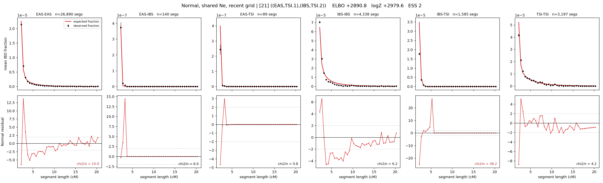

# `((EAS,TSI.1),(IBS,TSI.2))`

**Normal, shared Ne, recent grid** | topology 21 of 21 | admixed leaf: **TSI** | 4 events, 8 nodes

> Recent Ne grid: 0-5 and 5-10 generations. The first demographic event is explicitly constrained to occur after generation 10 (minimum 11 with the current one-generation gap).

## Model score

| quantity | value | |
|---|---|---|
| ELBO | +2890.84 | +- 1.54 (MC) |
| logZ (importance sampling) | +2979.62 | |
| ESS of the IS weights | 2.4 / 4000 | LOW -- treat logZ with suspicion |
| Stan dropped-constant correction | -29.61 | already applied |
| mode kept / MAP start / runtime | 1 / 2 | 28 s |
| mode search | 12/12 MAP starts succeeded | 3 distinct modes evaluated |

## Events (in temporal order, most recent first)

| # | type | detail | time (gen) | cumulative |
|---|---|---|---|---|
| 1 | ADMIXTURE | TSI -> TSI.1 + TSI.2 | 40.3 +- 0.6 | 40.3 |
| 2 | MERGE | TSI.1 + EAS -> n1 | 160.4 +- 0.8 | 200.6 |
| 3 | MERGE | TSI.2 + IBS -> n2 | 1.1 +- 0.0 | 201.8 |
| 4 | MERGE | n1 + n2 -> root | 240.4 +- 0.7 | 442.1 |

## Admixture fraction

**f = 0.001 +- 0.000** (fraction from `TSI.1`; 0.999 from `TSI.2`)

Collapsed to a tree: one source carries <5% of the ancestry, so this graph is behaving as its no-admixture special case.

## Recent effective sizes shared by IBD and SNP (haploid)

| population | 0-5 gen | 5-10 gen |
|---|---:|---:|
| `EAS` | 11,314,403 | 8,788,795 |
| `IBS` | 3,456,230 | 2,197,525 |
| `TSI` | 1,210,412 | 761,890 |

## Effective sizes shared by IBD and SNP (haploid)

| node | Ne | sd of log Ne |
|---|---|---|
| `EAS` | 1,805,190 | 0.07 |
| `IBS` | 333,082 | 0.09 |
| `TSI` | 319,771 | 0.16 |
| `TSI.1` | 19,360 | 0.05 |
| `TSI.2` | 830,635 | 0.07 |
| `n1` | 4,263 | 0.05 |
| `n2` | 1,959 | 0.03 |
| `root` | 0 | 0.01 |

log-Ne random-walk step scale tau = 2.099

## Fit quality by component

| component | log-likelihood | n terms | chi2/n |
|---|---|---|---|
| IBD | +3,146.9 | 222 | 11.43 |
| SNP | +0.9 | 6 | 14.23 |

IBD chi2/n uses Palamara model-derived Normal variance; SNP chi2/n uses its block SEs. Values near 1 indicate residuals on the modeled noise scale.

## SNP covariance residuals `(w_hat - W_pred)/w_se`

| | EAS | IBS | TSI |
|---|---|---|---|
| **EAS** | +0.87 | -0.49 | -1.23 |
| **IBS** | -0.49 | +2.62 | -1.81 |
| **TSI** | -1.23 | -1.81 | +4.05 |

