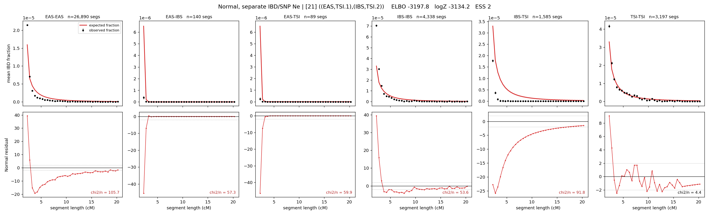

# `((EAS,TSI.1),(IBS,TSI.2))`

**Normal, separate IBD/SNP Ne** | topology 21 of 21 | admixed leaf: **TSI** | 4 events, 8 nodes

## Model score

| quantity | value | |
|---|---|---|
| ELBO | -3197.76 | +- 1.16 (MC) |
| logZ (importance sampling) | -3134.22 | |
| ESS of the IS weights | 2.4 / 4000 | LOW -- treat logZ with suspicion |
| Stan dropped-constant correction | -29.78 | already applied |
| seed kept / runtime | 7 | 17 s |

## Events (in temporal order, most recent first)

| # | type | detail | time (gen) | cumulative |
|---|---|---|---|---|
| 1 | ADMIXTURE | TSI -> TSI.1 + TSI.2 | 1.0 +- 0.0 | 1.0 |
| 2 | MERGE | TSI.1 + EAS -> n1 | 1.0 +- 0.0 | 2.0 |
| 3 | MERGE | TSI.2 + IBS -> n2 | 1.0 +- 0.0 | 3.0 |
| 4 | MERGE | n1 + n2 -> root | 353.7 +- 1.9 | 356.7 |

## Admixture fraction

**f = 0.000 +- 0.000** (fraction from `TSI.1`; 1.000 from `TSI.2`)

Collapsed to a tree: one source carries <5% of the ancestry, so this graph is behaving as its no-admixture special case.

## Effective sizes for IBD (haploid)

| node | Ne | sd of log Ne |
|---|---|---|
| `EAS` | 1,536,114 | 0.03 |
| `IBS` | 450,457 | 0.06 |
| `TSI` | 416,100 | 0.06 |
| `TSI.1` | 1,061,280 | 0.03 |
| `TSI.2` | 415,337 | 0.06 |
| `n1` | 1,061,308 | 0.03 |
| `n2` | 378,738 | 0.05 |
| `root` | 12 | 0.13 |

log-Ne random-walk step scale tau_ibd = 1.872

## Effective sizes for SNP (haploid)

| node | Ne | sd of log Ne |
|---|---|---|
| `EAS` | 3,923 | 0.02 |
| `IBS` | 3,920 | 0.02 |
| `TSI` | 3,920 | 0.02 |
| `TSI.1` | 3,923 | 0.02 |
| `TSI.2` | 3,920 | 0.02 |
| `n1` | 3,923 | 0.02 |
| `n2` | 3,920 | 0.02 |
| `root` | 3,922 | 0.02 |

log-Ne random-walk step scale tau_snp = 0.000

## Fit quality by component

| component | log-likelihood | n terms | chi2/n |
|---|---|---|---|
| IBD | -2,921.4 | 222 | 62.34 |
| SNP | +13.0 | 6 | 10.21 |

IBD chi2/n uses Palamara model-derived Normal variance; SNP chi2/n uses its block SEs. Values near 1 indicate residuals on the modeled noise scale.

## SNP covariance residuals `(w_hat - W_pred)/w_se`

| | EAS | IBS | TSI |
|---|---|---|---|
| **EAS** | -0.37 | +0.43 | +0.30 |
| **IBS** | +0.43 | +1.15 | -2.10 |
| **TSI** | +0.30 | -2.10 | +1.40 |

