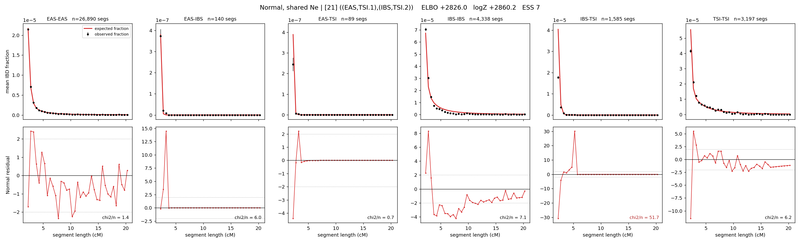

# `((EAS,TSI.1),(IBS,TSI.2))`

**Normal, shared Ne** | topology 21 of 21 | admixed leaf: **TSI** | 4 events, 8 nodes

## Model score

| quantity | value | |
|---|---|---|
| ELBO | +2826.01 | +- 0.63 (MC) |
| logZ (importance sampling) | +2860.23 | |
| ESS of the IS weights | 7.3 / 4000 | LOW -- treat logZ with suspicion |
| Stan dropped-constant correction | -24.10 | already applied |
| mode kept / MAP start / runtime | 3 / 3 | 20 s |
| mode search | 12/12 MAP starts succeeded | 3 distinct modes evaluated |

## Events (in temporal order, most recent first)

| # | type | detail | time (gen) | cumulative |
|---|---|---|---|---|
| 1 | ADMIXTURE | TSI -> TSI.1 + TSI.2 | 56.3 +- 0.3 | 56.3 |
| 2 | MERGE | TSI.1 + EAS -> n1 | 81.4 +- 0.5 | 137.7 |
| 3 | MERGE | TSI.2 + IBS -> n2 | 70.1 +- 1.0 | 207.8 |
| 4 | MERGE | n1 + n2 -> root | 231.8 +- 0.7 | 439.6 |

## Admixture fraction

**f = 0.000 +- 0.000** (fraction from `TSI.1`; 1.000 from `TSI.2`)

Collapsed to a tree: one source carries <5% of the ancestry, so this graph is behaving as its no-admixture special case.

## Effective sizes shared by IBD and SNP (haploid)

| node | Ne | sd of log Ne |
|---|---|---|
| `EAS` | 2,438,763 | 0.03 |
| `IBS` | 369,363 | 0.04 |
| `TSI` | 370,267 | 0.03 |
| `TSI.1` | 31,874 | 0.02 |
| `TSI.2` | 1,823,308 | 0.03 |
| `n1` | 33,163 | 0.02 |
| `n2` | 1,363 | 0.02 |
| `root` | 3 | 0.01 |

log-Ne random-walk step scale tau = 1.563

## Fit quality by component

| component | log-likelihood | n terms | chi2/n |
|---|---|---|---|
| IBD | +3,010.9 | 222 | 12.41 |
| SNP | +19.6 | 6 | 8.02 |

IBD chi2/n uses Palamara model-derived Normal variance; SNP chi2/n uses its block SEs. Values near 1 indicate residuals on the modeled noise scale.

## SNP covariance residuals `(w_hat - W_pred)/w_se`

| | EAS | IBS | TSI |
|---|---|---|---|
| **EAS** | +1.08 | -0.76 | -1.37 |
| **IBS** | -0.76 | +3.06 | -1.73 |
| **TSI** | -1.37 | -1.73 | +4.25 |

