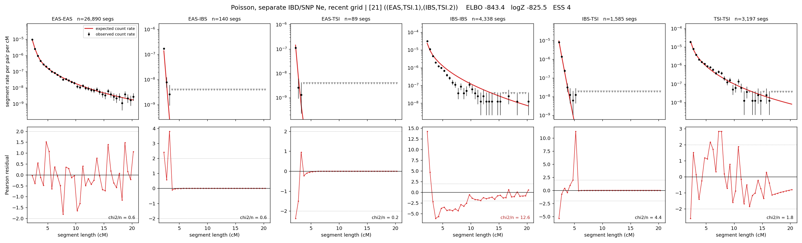

# `((EAS,TSI.1),(IBS,TSI.2))`

**Poisson, separate IBD/SNP Ne, recent grid** | topology 21 of 21 | admixed leaf: **TSI** | 4 events, 8 nodes

> Recent Ne grid: 0-5 and 5-10 generations. The first demographic event is explicitly constrained to occur after generation 10 (minimum 11 with the current one-generation gap).

## Model score

| quantity | value | |
|---|---|---|
| ELBO | -843.36 | +- 0.20 (MC) |
| logZ (importance sampling) | -825.46 | |
| ESS of the IS weights | 3.7 / 4000 | LOW -- treat logZ with suspicion |
| Stan dropped-constant correction | -40.81 | already applied |
| seed kept / runtime | 1 | 23 s |

## Events (in temporal order, most recent first)

| # | type | detail | time (gen) | cumulative |
|---|---|---|---|---|
| 1 | ADMIXTURE | TSI -> TSI.1 + TSI.2 | 11.0 +- 0.0 | 11.0 |
| 2 | MERGE | TSI.1 + EAS -> n1 | 119.5 +- 0.6 | 130.5 |
| 3 | MERGE | TSI.2 + IBS -> n2 | 32.8 +- 1.3 | 163.3 |
| 4 | MERGE | n1 + n2 -> root | 124.6 +- 0.8 | 287.9 |

## Admixture fraction

**f = 0.001 +- 0.000** (fraction from `TSI.1`; 0.999 from `TSI.2`)

Collapsed to a tree: one source carries <5% of the ancestry, so this graph is behaving as its no-admixture special case.

## Recent effective sizes for IBD (haploid)

| population | 0-5 gen | 5-10 gen |
|---|---:|---:|
| `EAS` | 4,178,182 | 3,829,843 |
| `IBS` | 2,453,422 | 1,723,393 |
| `TSI` | 1,123,087 | 871,592 |

## Effective sizes for IBD (haploid)

| node | Ne | sd of log Ne |
|---|---|---|
| `EAS` | 2,420,672 | 0.04 |
| `IBS` | 295,763 | 0.04 |
| `TSI` | 466,403 | 0.05 |
| `TSI.1` | 42,778 | 0.02 |
| `TSI.2` | 407,267 | 0.05 |
| `n1` | 41,647 | 0.02 |
| `n2` | 12,272 | 0.02 |
| `root` | 10,572 | 0.01 |

log-Ne random-walk step scale tau_ibd = 1.757

## Recent effective sizes for SNP (haploid)

| population | 0-5 gen | 5-10 gen |
|---|---:|---:|
| `EAS` | 16,769 | 16,348 |
| `IBS` | 170,322 | 158,252 |
| `TSI` | 116,162 | 112,602 |

## Effective sizes for SNP (haploid)

| node | Ne | sd of log Ne |
|---|---|---|
| `EAS` | 15,030 | 0.03 |
| `IBS` | 118,354 | 0.04 |
| `TSI` | 104,074 | 0.07 |
| `TSI.1` | 7,595 | 0.02 |
| `TSI.2` | 101,950 | 0.07 |
| `n1` | 7,496 | 0.02 |
| `n2` | 826 | 0.01 |
| `root` | 8,225 | 0.00 |

log-Ne random-walk step scale tau_snp = 1.375

## Fit quality by component

| component | log-likelihood | n terms | chi2/n |
|---|---|---|---|
| IBD | -608.0 | 222 | 3.48 |
| SNP | +40.9 | 6 | 0.89 |

IBD chi2/n uses Poisson counting variance; SNP chi2/n uses its block SEs. Values near 1 indicate residuals on the modeled noise scale.

## SNP covariance residuals `(w_hat - W_pred)/w_se`

| | EAS | IBS | TSI |
|---|---|---|---|
| **EAS** | +0.02 | +0.03 | -0.08 |
| **IBS** | +0.03 | -0.41 | +0.38 |
| **TSI** | -0.08 | +0.38 | -0.21 |

