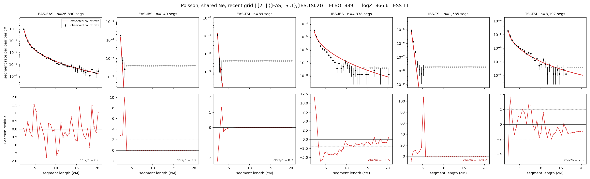

# `((EAS,TSI.1),(IBS,TSI.2))`

**Poisson, shared Ne, recent grid** | topology 21 of 21 | admixed leaf: **TSI** | 4 events, 8 nodes

> Recent Ne grid: 0-5 and 5-10 generations. The first demographic event is explicitly constrained to occur after generation 10 (minimum 11 with the current one-generation gap).

## Model score

| quantity | value | |
|---|---|---|
| ELBO | -889.10 | +- 0.31 (MC) |
| logZ (importance sampling) | -866.56 | |
| ESS of the IS weights | 10.7 / 4000 | LOW -- treat logZ with suspicion |
| Stan dropped-constant correction | -29.61 | already applied |
| seed kept / runtime | 1 | 23 s |

## Events (in temporal order, most recent first)

| # | type | detail | time (gen) | cumulative |
|---|---|---|---|---|
| 1 | ADMIXTURE | TSI -> TSI.1 + TSI.2 | 11.0 +- 0.0 | 11.0 |
| 2 | MERGE | TSI.1 + EAS -> n1 | 118.8 +- 0.7 | 129.8 |
| 3 | MERGE | TSI.2 + IBS -> n2 | 110.6 +- 1.3 | 240.4 |
| 4 | MERGE | n1 + n2 -> root | 134.7 +- 2.0 | 375.1 |

## Admixture fraction

**f = 0.001 +- 0.000** (fraction from `TSI.1`; 0.999 from `TSI.2`)

Collapsed to a tree: one source carries <5% of the ancestry, so this graph is behaving as its no-admixture special case.

## Recent effective sizes shared by IBD and SNP (haploid)

| population | 0-5 gen | 5-10 gen |
|---|---:|---:|
| `EAS` | 4,260,953 | 3,738,456 |
| `IBS` | 1,866,249 | 1,292,451 |
| `TSI` | 754,042 | 652,513 |

## Effective sizes shared by IBD and SNP (haploid)

| node | Ne | sd of log Ne |
|---|---|---|
| `EAS` | 2,427,773 | 0.04 |
| `IBS` | 296,031 | 0.04 |
| `TSI` | 449,706 | 0.05 |
| `TSI.1` | 45,667 | 0.03 |
| `TSI.2` | 404,844 | 0.05 |
| `n1` | 42,746 | 0.03 |
| `n2` | 768 | 0.02 |
| `root` | 414 | 0.05 |

log-Ne random-walk step scale tau = 1.722

## Fit quality by component

| component | log-likelihood | n terms | chi2/n |
|---|---|---|---|
| IBD | -723.1 | 222 | 58.09 |
| SNP | +33.8 | 6 | 3.26 |

IBD chi2/n uses Poisson counting variance; SNP chi2/n uses its block SEs. Values near 1 indicate residuals on the modeled noise scale.

## SNP covariance residuals `(w_hat - W_pred)/w_se`

| | EAS | IBS | TSI |
|---|---|---|---|
| **EAS** | -0.13 | +0.44 | -0.19 |
| **IBS** | +0.44 | +1.12 | -2.10 |
| **TSI** | -0.19 | -2.10 | +2.35 |

