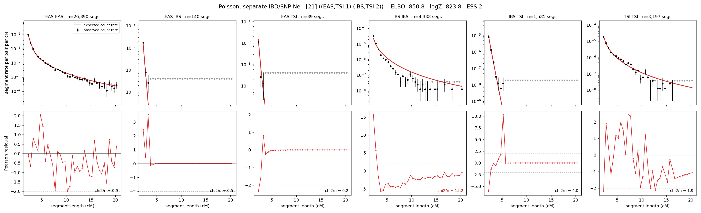

# `((EAS,TSI.1),(IBS,TSI.2))`

**Poisson, separate IBD/SNP Ne** | topology 21 of 21 | admixed leaf: **TSI** | 4 events, 8 nodes

## Model score

| quantity | value | |
|---|---|---|
| ELBO | -850.77 | +- 0.27 (MC) |
| logZ (importance sampling) | -823.80 | |
| ESS of the IS weights | 2.0 / 4000 | LOW -- treat logZ with suspicion |
| Stan dropped-constant correction | -29.78 | already applied |
| seed kept / runtime | 7 | 17 s |

## Events (in temporal order, most recent first)

| # | type | detail | time (gen) | cumulative |
|---|---|---|---|---|
| 1 | ADMIXTURE | TSI -> TSI.1 + TSI.2 | 1.2 +- 0.2 | 1.2 |
| 2 | MERGE | TSI.1 + EAS -> n1 | 126.8 +- 0.7 | 128.0 |
| 3 | MERGE | TSI.2 + IBS -> n2 | 32.7 +- 2.7 | 160.7 |
| 4 | MERGE | n1 + n2 -> root | 121.0 +- 6.8 | 281.7 |

## Admixture fraction

**f = 0.001 +- 0.000** (fraction from `TSI.1`; 0.999 from `TSI.2`)

Collapsed to a tree: one source carries <5% of the ancestry, so this graph is behaving as its no-admixture special case.

## Effective sizes for IBD (haploid)

| node | Ne | sd of log Ne |
|---|---|---|
| `EAS` | 2,564,183 | 0.02 |
| `IBS` | 315,674 | 0.05 |
| `TSI` | 426,872 | 0.03 |
| `TSI.1` | 44,951 | 0.02 |
| `TSI.2` | 424,005 | 0.03 |
| `n1` | 44,340 | 0.01 |
| `n2` | 13,111 | 0.09 |
| `root` | 13,439 | 0.15 |

log-Ne random-walk step scale tau_ibd = 1.261

## Effective sizes for SNP (haploid)

| node | Ne | sd of log Ne |
|---|---|---|
| `EAS` | 85,804 | 1.96 |
| `IBS` | 127,728 | 0.06 |
| `TSI` | 96,549 | 0.05 |
| `TSI.1` | 18,391 | 0.83 |
| `TSI.2` | 95,923 | 0.05 |
| `n1` | 17,917 | 0.81 |
| `n2` | 1,323 | 0.63 |
| `root` | 9,640 | 0.28 |

log-Ne random-walk step scale tau_snp = 1.260

## Fit quality by component

| component | log-likelihood | n terms | chi2/n |
|---|---|---|---|
| IBD | -684.4 | 222 | 3.89 |
| SNP | +37.8 | 6 | 1.95 |

IBD chi2/n uses Poisson counting variance; SNP chi2/n uses its block SEs. Values near 1 indicate residuals on the modeled noise scale.

## SNP covariance residuals `(w_hat - W_pred)/w_se`

| | EAS | IBS | TSI |
|---|---|---|---|
| **EAS** | -0.01 | -0.03 | +0.04 |
| **IBS** | -0.03 | -0.25 | +0.32 |
| **TSI** | +0.04 | +0.32 | -0.38 |

