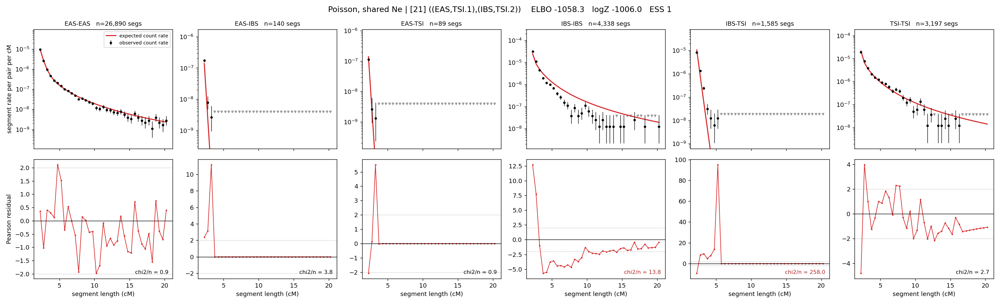

# `((EAS,TSI.1),(IBS,TSI.2))`

**Poisson, shared Ne** | topology 21 of 21 | admixed leaf: **TSI** | 4 events, 8 nodes

## Model score

| quantity | value | |
|---|---|---|
| ELBO | -1058.30 | +- 1.03 (MC) |
| logZ (importance sampling) | -1006.04 | |
| ESS of the IS weights | 1.3 / 4000 | LOW -- treat logZ with suspicion |
| Stan dropped-constant correction | -24.10 | already applied |
| seed kept / runtime | 7 | 15 s |

## Events (in temporal order, most recent first)

| # | type | detail | time (gen) | cumulative |
|---|---|---|---|---|
| 1 | ADMIXTURE | TSI -> TSI.1 + TSI.2 | 1.0 +- 0.0 | 1.0 |
| 2 | MERGE | TSI.1 + EAS -> n1 | 124.8 +- 0.9 | 125.9 |
| 3 | MERGE | TSI.2 + IBS -> n2 | 111.1 +- 2.4 | 237.0 |
| 4 | MERGE | n1 + n2 -> root | 151.2 +- 3.9 | 388.2 |

## Admixture fraction

**f = 0.000 +- 0.000** (fraction from `TSI.1`; 1.000 from `TSI.2`)

Collapsed to a tree: one source carries <5% of the ancestry, so this graph is behaving as its no-admixture special case.

## Effective sizes shared by IBD and SNP (haploid)

| node | Ne | sd of log Ne |
|---|---|---|
| `EAS` | 2,592,642 | 0.07 |
| `IBS` | 314,016 | 0.08 |
| `TSI` | 433,773 | 0.10 |
| `TSI.1` | 51,113 | 0.03 |
| `TSI.2` | 420,714 | 0.10 |
| `n1` | 47,701 | 0.03 |
| `n2` | 862 | 0.03 |
| `root` | 236 | 0.13 |

log-Ne random-walk step scale tau = 1.591

## Fit quality by component

| component | log-likelihood | n terms | chi2/n |
|---|---|---|---|
| IBD | -822.6 | 222 | 50.48 |
| SNP | +29.1 | 6 | 4.85 |

IBD chi2/n uses Poisson counting variance; SNP chi2/n uses its block SEs. Values near 1 indicate residuals on the modeled noise scale.

## SNP covariance residuals `(w_hat - W_pred)/w_se`

| | EAS | IBS | TSI |
|---|---|---|---|
| **EAS** | -0.17 | +0.33 | +0.02 |
| **IBS** | +0.33 | +1.44 | -2.21 |
| **TSI** | +0.02 | -2.21 | +2.05 |

