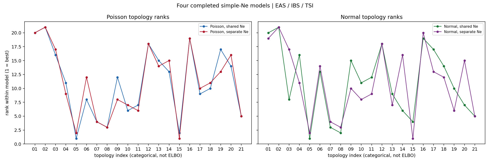

# Four completed simple-Ne models on EAS / IBS / TSI

These are the completed multistart reruns. Grid-Ne results are excluded until that batch finishes.

## Best topology within each model

| model | winner | ELBO (nats) | runner-up dELBO | mode range | ESS |
|---|---|---:|---:|---:|---:|
| Poisson, shared Ne | `(((EAS.1,IBS),TSI),EAS.2)` | -523.1 | -75.8 | 20.4 | 1.1 |
| Poisson, separate Ne | `((EAS,IBS.1),(IBS.2,TSI))` | -499.8 | -29.5 | 384.8 | 5.0 |
| Normal, shared Ne | `(((EAS.1,IBS),TSI),EAS.2)` | +4023.2 | -146.7 | 236.4 | 20.5 |
| Normal, separate Ne | `((EAS,IBS.1),(IBS.2,TSI))` | +4112.2 | -42.3 | 26.7 | 1.3 |

## Rank consistency

The horizontal position in the figure is only the topology index. ELBO ranking is on the vertical axis; individual ranking plots use horizontal `ELBO - best` in natural-log units (nats).

| comparison | Spearman rho | top-5 overlap |
|---|---:|---:|
| Poisson shared vs separate | +0.956 | 5/5 |
| Normal shared vs separate | +0.761 | 5/5 |
| Shared Ne: Poisson vs Normal | +0.713 | 5/5 |
| Separate Ne: Poisson vs Normal | +0.913 | 5/5 |

