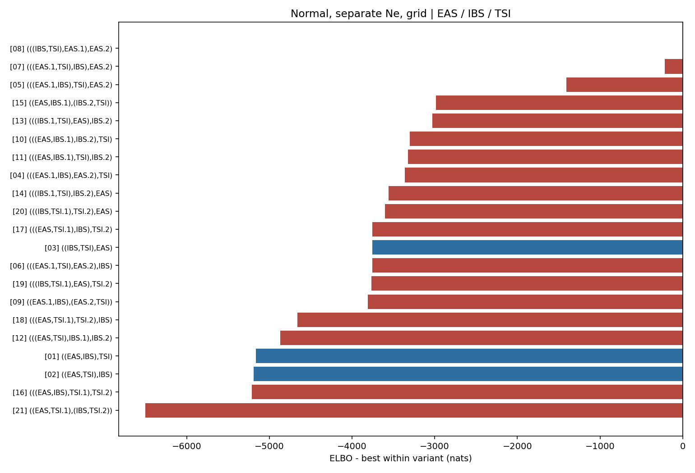

# Normal, separate Ne, grid topology ranking

Populations: **EAS / IBS / TSI**

The weight is a softmax of Pathfinder ELBOs, not a posterior model probability.

| rank | topology | ELBO | dELBO | ELBO weight |
|---|---|---:|---:|---:|
| 1 | [`(((IBS,TSI),EAS.1),EAS.2)`](../../08_(((IBS,TSI),EAS.1),EAS.2)/normal_grid_separate_ne/report.md) | +3807.4 | +0.0 | 1.0000 |
| 2 | [`(((EAS.1,TSI),IBS),EAS.2)`](../../07_(((EAS.1,TSI),IBS),EAS.2)/normal_grid_separate_ne/report.md) | +3587.8 | -219.6 | 0.0000 |
| 3 | [`(((EAS.1,IBS),TSI),EAS.2)`](../../05_(((EAS.1,IBS),TSI),EAS.2)/normal_grid_separate_ne/report.md) | +2400.4 | -1407.0 | 0.0000 |
| 4 | [`((EAS,IBS.1),(IBS.2,TSI))`](../../15_((EAS,IBS.1),(IBS.2,TSI))/normal_grid_separate_ne/report.md) | +823.6 | -2983.8 | 0.0000 |
| 5 | [`(((IBS.1,TSI),EAS),IBS.2)`](../../13_(((IBS.1,TSI),EAS),IBS.2)/normal_grid_separate_ne/report.md) | +779.5 | -3027.9 | 0.0000 |
| 6 | [`(((EAS,IBS.1),IBS.2),TSI)`](../../10_(((EAS,IBS.1),IBS.2),TSI)/normal_grid_separate_ne/report.md) | +505.0 | -3302.4 | 0.0000 |
| 7 | [`(((EAS,IBS.1),TSI),IBS.2)`](../../11_(((EAS,IBS.1),TSI),IBS.2)/normal_grid_separate_ne/report.md) | +483.4 | -3324.0 | 0.0000 |
| 8 | [`(((EAS.1,IBS),EAS.2),TSI)`](../../04_(((EAS.1,IBS),EAS.2),TSI)/normal_grid_separate_ne/report.md) | +446.8 | -3360.6 | 0.0000 |
| 9 | [`(((IBS.1,TSI),IBS.2),EAS)`](../../14_(((IBS.1,TSI),IBS.2),EAS)/normal_grid_separate_ne/report.md) | +251.7 | -3555.7 | 0.0000 |
| 10 | [`(((IBS,TSI.1),TSI.2),EAS)`](../../20_(((IBS,TSI.1),TSI.2),EAS)/normal_grid_separate_ne/report.md) | +204.8 | -3602.6 | 0.0000 |
| 11 | [`(((EAS,TSI.1),IBS),TSI.2)`](../../17_(((EAS,TSI.1),IBS),TSI.2)/normal_grid_separate_ne/report.md) | +55.0 | -3752.5 | 0.0000 |
| 12 | [`((IBS,TSI),EAS)`](../../03_((IBS,TSI),EAS)/normal_grid_separate_ne/report.md) | +54.5 | -3752.9 | 0.0000 |
| 13 | [`(((EAS.1,TSI),EAS.2),IBS)`](../../06_(((EAS.1,TSI),EAS.2),IBS)/normal_grid_separate_ne/report.md) | +53.5 | -3753.9 | 0.0000 |
| 14 | [`(((IBS,TSI.1),EAS),TSI.2)`](../../19_(((IBS,TSI.1),EAS),TSI.2)/normal_grid_separate_ne/report.md) | +40.6 | -3766.8 | 0.0000 |
| 15 | [`((EAS.1,IBS),(EAS.2,TSI))`](../../09_((EAS.1,IBS),(EAS.2,TSI))/normal_grid_separate_ne/report.md) | +0.8 | -3806.6 | 0.0000 |
| 16 | [`(((EAS,TSI.1),TSI.2),IBS)`](../../18_(((EAS,TSI.1),TSI.2),IBS)/normal_grid_separate_ne/report.md) | -850.6 | -4658.0 | 0.0000 |
| 17 | [`(((EAS,TSI),IBS.1),IBS.2)`](../../12_(((EAS,TSI),IBS.1),IBS.2)/normal_grid_separate_ne/report.md) | -1062.8 | -4870.2 | 0.0000 |
| 18 | [`((EAS,IBS),TSI)`](../../01_((EAS,IBS),TSI)/normal_grid_separate_ne/report.md) | -1354.3 | -5161.7 | 0.0000 |
| 19 | [`((EAS,TSI),IBS)`](../../02_((EAS,TSI),IBS)/normal_grid_separate_ne/report.md) | -1384.8 | -5192.3 | 0.0000 |
| 20 | [`(((EAS,IBS),TSI.1),TSI.2)`](../../16_(((EAS,IBS),TSI.1),TSI.2)/normal_grid_separate_ne/report.md) | -1406.5 | -5213.9 | 0.0000 |
| 21 | [`((EAS,TSI.1),(IBS,TSI.2))`](../../21_((EAS,TSI.1),(IBS,TSI.2))/normal_grid_separate_ne/report.md) | -2691.7 | -6499.1 | 0.0000 |

