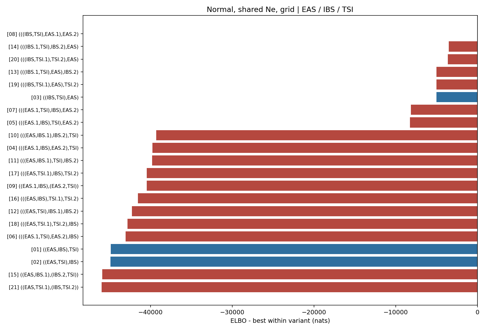

# Normal, shared Ne, grid topology ranking

Populations: **EAS / IBS / TSI**

The weight is a softmax of Pathfinder ELBOs, not a posterior model probability.

| rank | topology | ELBO | dELBO | ELBO weight |
|---|---|---:|---:|---:|
| 1 | [`(((IBS,TSI),EAS.1),EAS.2)`](../../08_(((IBS,TSI),EAS.1),EAS.2)/normal_grid_shared_ne/report.md) | +3906.7 | +0.0 | 1.0000 |
| 2 | [`(((IBS.1,TSI),IBS.2),EAS)`](../../14_(((IBS.1,TSI),IBS.2),EAS)/normal_grid_shared_ne/report.md) | +384.6 | -3522.1 | 0.0000 |
| 3 | [`(((IBS,TSI.1),TSI.2),EAS)`](../../20_(((IBS,TSI.1),TSI.2),EAS)/normal_grid_shared_ne/report.md) | +285.9 | -3620.8 | 0.0000 |
| 4 | [`(((IBS.1,TSI),EAS),IBS.2)`](../../13_(((IBS.1,TSI),EAS),IBS.2)/normal_grid_shared_ne/report.md) | -1099.1 | -5005.8 | 0.0000 |
| 5 | [`(((IBS,TSI.1),EAS),TSI.2)`](../../19_(((IBS,TSI.1),EAS),TSI.2)/normal_grid_shared_ne/report.md) | -1112.2 | -5018.9 | 0.0000 |
| 6 | [`((IBS,TSI),EAS)`](../../03_((IBS,TSI),EAS)/normal_grid_shared_ne/report.md) | -1118.3 | -5025.0 | 0.0000 |
| 7 | [`(((EAS.1,TSI),IBS),EAS.2)`](../../07_(((EAS.1,TSI),IBS),EAS.2)/normal_grid_shared_ne/report.md) | -4250.4 | -8157.1 | 0.0000 |
| 8 | [`(((EAS.1,IBS),TSI),EAS.2)`](../../05_(((EAS.1,IBS),TSI),EAS.2)/normal_grid_shared_ne/report.md) | -4337.5 | -8244.2 | 0.0000 |
| 9 | [`(((EAS,IBS.1),IBS.2),TSI)`](../../10_(((EAS,IBS.1),IBS.2),TSI)/normal_grid_shared_ne/report.md) | -35373.2 | -39279.9 | 0.0000 |
| 10 | [`(((EAS.1,IBS),EAS.2),TSI)`](../../04_(((EAS.1,IBS),EAS.2),TSI)/normal_grid_shared_ne/report.md) | -35866.8 | -39773.6 | 0.0000 |
| 11 | [`(((EAS,IBS.1),TSI),IBS.2)`](../../11_(((EAS,IBS.1),TSI),IBS.2)/normal_grid_shared_ne/report.md) | -35879.5 | -39786.2 | 0.0000 |
| 12 | [`(((EAS,TSI.1),IBS),TSI.2)`](../../17_(((EAS,TSI.1),IBS),TSI.2)/normal_grid_shared_ne/report.md) | -36560.2 | -40466.9 | 0.0000 |
| 13 | [`((EAS.1,IBS),(EAS.2,TSI))`](../../09_((EAS.1,IBS),(EAS.2,TSI))/normal_grid_shared_ne/report.md) | -36562.2 | -40468.9 | 0.0000 |
| 14 | [`(((EAS,IBS),TSI.1),TSI.2)`](../../16_(((EAS,IBS),TSI.1),TSI.2)/normal_grid_shared_ne/report.md) | -37639.9 | -41546.6 | 0.0000 |
| 15 | [`(((EAS,TSI),IBS.1),IBS.2)`](../../12_(((EAS,TSI),IBS.1),IBS.2)/normal_grid_shared_ne/report.md) | -38372.9 | -42279.6 | 0.0000 |
| 16 | [`(((EAS,TSI.1),TSI.2),IBS)`](../../18_(((EAS,TSI.1),TSI.2),IBS)/normal_grid_shared_ne/report.md) | -38889.4 | -42796.1 | 0.0000 |
| 17 | [`(((EAS.1,TSI),EAS.2),IBS)`](../../06_(((EAS.1,TSI),EAS.2),IBS)/normal_grid_shared_ne/report.md) | -39124.3 | -43031.0 | 0.0000 |
| 18 | [`((EAS,IBS),TSI)`](../../01_((EAS,IBS),TSI)/normal_grid_shared_ne/report.md) | -40938.4 | -44845.1 | 0.0000 |
| 19 | [`((EAS,TSI),IBS)`](../../02_((EAS,TSI),IBS)/normal_grid_shared_ne/report.md) | -40979.5 | -44886.2 | 0.0000 |
| 20 | [`((EAS,IBS.1),(IBS.2,TSI))`](../../15_((EAS,IBS.1),(IBS.2,TSI))/normal_grid_shared_ne/report.md) | -42006.2 | -45912.9 | 0.0000 |
| 21 | [`((EAS,TSI.1),(IBS,TSI.2))`](../../21_((EAS,TSI.1),(IBS,TSI.2))/normal_grid_shared_ne/report.md) | -42059.2 | -45965.9 | 0.0000 |

