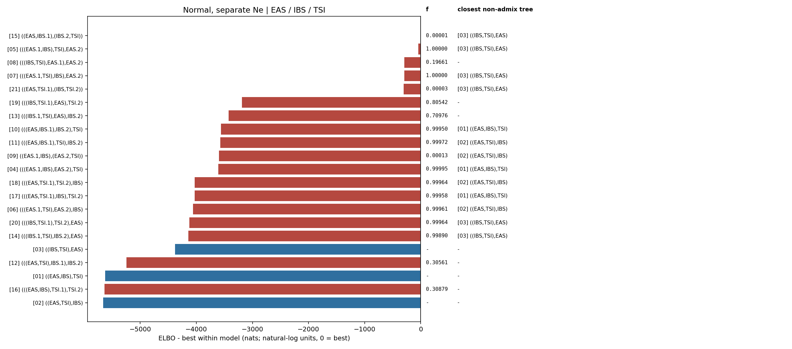

# Normal, separate Ne topology ranking

Populations: **EAS / IBS / TSI**

The weight is a softmax of Pathfinder ELBOs, not a posterior model probability.
Each topology is screened from dispersed MAP starts; distinct high-MAP modes are then fitted independently with Pathfinder. Search diagnostics are retained in `fit.json` and `elbo_table.csv`.
`f` is the fitted ancestry fraction from the first named source branch; tree topologies have no fraction. The closest tree is shown when `min(f, 1-f) < 0.01`.

| rank | topology | f | closest non-admix tree | ELBO | dELBO | ELBO weight |
|---|---|---:|---|---:|---:|---:|
| 1 | [`((EAS,IBS.1),(IBS.2,TSI))`](../../15_((EAS,IBS.1),(IBS.2,TSI))/normal_separate_ne/report.md) | 0.00001 | `[03] ((IBS,TSI),EAS)` | +4112.2 | +0.0 | 1.0000 |
| 2 | [`(((EAS.1,IBS),TSI),EAS.2)`](../../05_(((EAS.1,IBS),TSI),EAS.2)/normal_separate_ne/report.md) | 1.00000 | `[03] ((IBS,TSI),EAS)` | +4069.9 | -42.3 | 0.0000 |
| 3 | [`(((IBS,TSI),EAS.1),EAS.2)`](../../08_(((IBS,TSI),EAS.1),EAS.2)/normal_separate_ne/report.md) | 0.19661 | `-` | +3820.6 | -291.7 | 0.0000 |
| 4 | [`(((EAS.1,TSI),IBS),EAS.2)`](../../07_(((EAS.1,TSI),IBS),EAS.2)/normal_separate_ne/report.md) | 1.00000 | `[03] ((IBS,TSI),EAS)` | +3817.8 | -294.5 | 0.0000 |
| 5 | [`((EAS,TSI.1),(IBS,TSI.2))`](../../21_((EAS,TSI.1),(IBS,TSI.2))/normal_separate_ne/report.md) | 0.00003 | `[03] ((IBS,TSI),EAS)` | +3808.1 | -304.2 | 0.0000 |
| 6 | [`(((IBS,TSI.1),EAS),TSI.2)`](../../19_(((IBS,TSI.1),EAS),TSI.2)/normal_separate_ne/report.md) | 0.80542 | `-` | +924.6 | -3187.6 | 0.0000 |
| 7 | [`(((IBS.1,TSI),EAS),IBS.2)`](../../13_(((IBS.1,TSI),EAS),IBS.2)/normal_separate_ne/report.md) | 0.70976 | `-` | +687.0 | -3425.2 | 0.0000 |
| 8 | [`(((EAS,IBS.1),IBS.2),TSI)`](../../10_(((EAS,IBS.1),IBS.2),TSI)/normal_separate_ne/report.md) | 0.99950 | `[01] ((EAS,IBS),TSI)` | +550.7 | -3561.5 | 0.0000 |
| 9 | [`(((EAS,IBS.1),TSI),IBS.2)`](../../11_(((EAS,IBS.1),TSI),IBS.2)/normal_separate_ne/report.md) | 0.99972 | `[02] ((EAS,TSI),IBS)` | +539.4 | -3572.8 | 0.0000 |
| 10 | [`((EAS.1,IBS),(EAS.2,TSI))`](../../09_((EAS.1,IBS),(EAS.2,TSI))/normal_separate_ne/report.md) | 0.00013 | `[02] ((EAS,TSI),IBS)` | +515.3 | -3596.9 | 0.0000 |
| 11 | [`(((EAS.1,IBS),EAS.2),TSI)`](../../04_(((EAS.1,IBS),EAS.2),TSI)/normal_separate_ne/report.md) | 0.99995 | `[01] ((EAS,IBS),TSI)` | +505.1 | -3607.1 | 0.0000 |
| 12 | [`(((EAS,TSI.1),TSI.2),IBS)`](../../18_(((EAS,TSI.1),TSI.2),IBS)/normal_separate_ne/report.md) | 0.99964 | `[02] ((EAS,TSI),IBS)` | +85.1 | -4027.1 | 0.0000 |
| 13 | [`(((EAS,TSI.1),IBS),TSI.2)`](../../17_(((EAS,TSI.1),IBS),TSI.2)/normal_separate_ne/report.md) | 0.99958 | `[01] ((EAS,IBS),TSI)` | +80.3 | -4032.0 | 0.0000 |
| 14 | [`(((EAS.1,TSI),EAS.2),IBS)`](../../06_(((EAS.1,TSI),EAS.2),IBS)/normal_separate_ne/report.md) | 0.99961 | `[02] ((EAS,TSI),IBS)` | +54.3 | -4058.0 | 0.0000 |
| 15 | [`(((IBS,TSI.1),TSI.2),EAS)`](../../20_(((IBS,TSI.1),TSI.2),EAS)/normal_separate_ne/report.md) | 0.99964 | `[03] ((IBS,TSI),EAS)` | -10.4 | -4122.7 | 0.0000 |
| 16 | [`(((IBS.1,TSI),IBS.2),EAS)`](../../14_(((IBS.1,TSI),IBS.2),EAS)/normal_separate_ne/report.md) | 0.99890 | `[03] ((IBS,TSI),EAS)` | -27.4 | -4139.6 | 0.0000 |
| 17 | [`((IBS,TSI),EAS)`](../../03_((IBS,TSI),EAS)/normal_separate_ne/report.md) | - | `-` | -267.2 | -4379.5 | 0.0000 |
| 18 | [`(((EAS,TSI),IBS.1),IBS.2)`](../../12_(((EAS,TSI),IBS.1),IBS.2)/normal_separate_ne/report.md) | 0.30561 | `-` | -1131.4 | -5243.6 | 0.0000 |
| 19 | [`((EAS,IBS),TSI)`](../../01_((EAS,IBS),TSI)/normal_separate_ne/report.md) | - | `-` | -1512.3 | -5624.5 | 0.0000 |
| 20 | [`(((EAS,IBS),TSI.1),TSI.2)`](../../16_(((EAS,IBS),TSI.1),TSI.2)/normal_separate_ne/report.md) | 0.30879 | `-` | -1526.5 | -5638.8 | 0.0000 |
| 21 | [`((EAS,TSI),IBS)`](../../02_((EAS,TSI),IBS)/normal_separate_ne/report.md) | - | `-` | -1545.8 | -5658.1 | 0.0000 |

