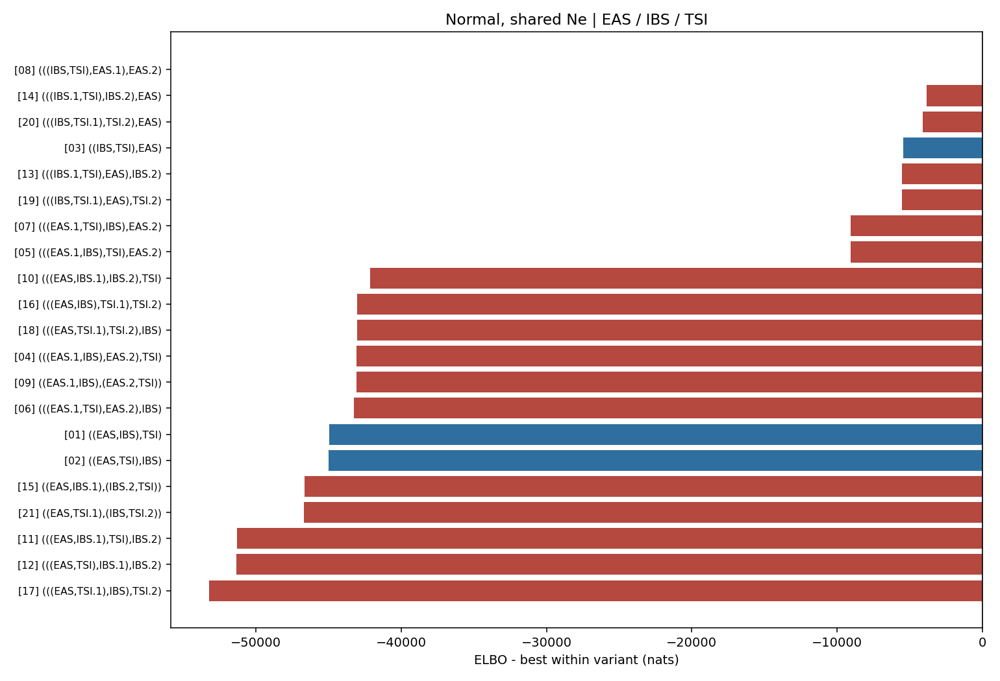

# Normal, shared Ne topology ranking

Populations: **EAS / IBS / TSI**

The weight is a softmax of Pathfinder ELBOs, not a posterior model probability.

| rank | topology | ELBO | dELBO | ELBO weight |
|---|---|---:|---:|---:|
| 1 | [`(((IBS,TSI),EAS.1),EAS.2)`](../../08_(((IBS,TSI),EAS.1),EAS.2)/normal_shared_ne/report.md) | +3869.0 | +0.0 | 1.0000 |
| 2 | [`(((IBS.1,TSI),IBS.2),EAS)`](../../14_(((IBS.1,TSI),IBS.2),EAS)/normal_shared_ne/report.md) | +31.5 | -3837.5 | 0.0000 |
| 3 | [`(((IBS,TSI.1),TSI.2),EAS)`](../../20_(((IBS,TSI.1),TSI.2),EAS)/normal_shared_ne/report.md) | -240.1 | -4109.2 | 0.0000 |
| 4 | [`((IBS,TSI),EAS)`](../../03_((IBS,TSI),EAS)/normal_shared_ne/report.md) | -1564.0 | -5433.1 | 0.0000 |
| 5 | [`(((IBS.1,TSI),EAS),IBS.2)`](../../13_(((IBS.1,TSI),EAS),IBS.2)/normal_shared_ne/report.md) | -1666.1 | -5535.1 | 0.0000 |
| 6 | [`(((IBS,TSI.1),EAS),TSI.2)`](../../19_(((IBS,TSI.1),EAS),TSI.2)/normal_shared_ne/report.md) | -1681.1 | -5550.2 | 0.0000 |
| 7 | [`(((EAS.1,TSI),IBS),EAS.2)`](../../07_(((EAS.1,TSI),IBS),EAS.2)/normal_shared_ne/report.md) | -5194.1 | -9063.1 | 0.0000 |
| 8 | [`(((EAS.1,IBS),TSI),EAS.2)`](../../05_(((EAS.1,IBS),TSI),EAS.2)/normal_shared_ne/report.md) | -5199.5 | -9068.5 | 0.0000 |
| 9 | [`(((EAS,IBS.1),IBS.2),TSI)`](../../10_(((EAS,IBS.1),IBS.2),TSI)/normal_shared_ne/report.md) | -38276.8 | -42145.8 | 0.0000 |
| 10 | [`(((EAS,IBS),TSI.1),TSI.2)`](../../16_(((EAS,IBS),TSI.1),TSI.2)/normal_shared_ne/report.md) | -39192.3 | -43061.3 | 0.0000 |
| 11 | [`(((EAS,TSI.1),TSI.2),IBS)`](../../18_(((EAS,TSI.1),TSI.2),IBS)/normal_shared_ne/report.md) | -39198.7 | -43067.7 | 0.0000 |
| 12 | [`(((EAS.1,IBS),EAS.2),TSI)`](../../04_(((EAS.1,IBS),EAS.2),TSI)/normal_shared_ne/report.md) | -39211.8 | -43080.9 | 0.0000 |
| 13 | [`((EAS.1,IBS),(EAS.2,TSI))`](../../09_((EAS.1,IBS),(EAS.2,TSI))/normal_shared_ne/report.md) | -39242.5 | -43111.6 | 0.0000 |
| 14 | [`(((EAS.1,TSI),EAS.2),IBS)`](../../06_(((EAS.1,TSI),EAS.2),IBS)/normal_shared_ne/report.md) | -39408.1 | -43277.1 | 0.0000 |
| 15 | [`((EAS,IBS),TSI)`](../../01_((EAS,IBS),TSI)/normal_shared_ne/report.md) | -41110.2 | -44979.3 | 0.0000 |
| 16 | [`((EAS,TSI),IBS)`](../../02_((EAS,TSI),IBS)/normal_shared_ne/report.md) | -41154.3 | -45023.3 | 0.0000 |
| 17 | [`((EAS,IBS.1),(IBS.2,TSI))`](../../15_((EAS,IBS.1),(IBS.2,TSI))/normal_shared_ne/report.md) | -42792.1 | -46661.1 | 0.0000 |
| 18 | [`((EAS,TSI.1),(IBS,TSI.2))`](../../21_((EAS,TSI.1),(IBS,TSI.2))/normal_shared_ne/report.md) | -42829.1 | -46698.1 | 0.0000 |
| 19 | [`(((EAS,IBS.1),TSI),IBS.2)`](../../11_(((EAS,IBS.1),TSI),IBS.2)/normal_shared_ne/report.md) | -47442.4 | -51311.5 | 0.0000 |
| 20 | [`(((EAS,TSI),IBS.1),IBS.2)`](../../12_(((EAS,TSI),IBS.1),IBS.2)/normal_shared_ne/report.md) | -47491.3 | -51360.3 | 0.0000 |
| 21 | [`(((EAS,TSI.1),IBS),TSI.2)`](../../17_(((EAS,TSI.1),IBS),TSI.2)/normal_shared_ne/report.md) | -49362.7 | -53231.7 | 0.0000 |

