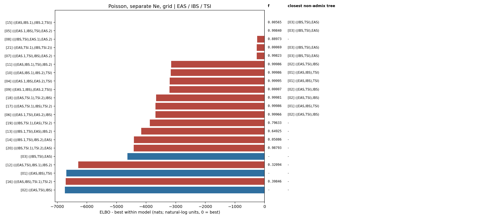

# Poisson, separate Ne, grid topology ranking

Populations: **EAS / IBS / TSI**

The weight is a softmax of Pathfinder ELBOs, not a posterior model probability.
Each topology is screened from dispersed MAP starts; distinct high-MAP modes are then fitted independently with Pathfinder. Search diagnostics are retained in `fit.json` and `elbo_table.csv`.
`f` is the fitted ancestry fraction from the first named source branch; tree topologies have no fraction. The closest tree is shown when `min(f, 1-f) < 0.01`.

| rank | topology | f | closest non-admix tree | ELBO | dELBO | ELBO weight |
|---|---|---:|---|---:|---:|---:|
| 1 | [`((EAS,IBS.1),(IBS.2,TSI))`](../../15_((EAS,IBS.1),(IBS.2,TSI))/poisson_grid_separate_ne/report.md) | 0.00565 | `[03] ((IBS,TSI),EAS)` | -549.4 | +0.0 | 1.0000 |
| 2 | [`(((EAS.1,IBS),TSI),EAS.2)`](../../05_(((EAS.1,IBS),TSI),EAS.2)/poisson_grid_separate_ne/report.md) | 0.99840 | `[03] ((IBS,TSI),EAS)` | -563.2 | -13.8 | 0.0000 |
| 3 | [`(((IBS,TSI),EAS.1),EAS.2)`](../../08_(((IBS,TSI),EAS.1),EAS.2)/poisson_grid_separate_ne/report.md) | 0.88973 | `-` | -801.1 | -251.7 | 0.0000 |
| 4 | [`((EAS,TSI.1),(IBS,TSI.2))`](../../21_((EAS,TSI.1),(IBS,TSI.2))/poisson_grid_separate_ne/report.md) | 0.00069 | `[03] ((IBS,TSI),EAS)` | -812.6 | -263.1 | 0.0000 |
| 5 | [`(((EAS.1,TSI),IBS),EAS.2)`](../../07_(((EAS.1,TSI),IBS),EAS.2)/poisson_grid_separate_ne/report.md) | 0.99823 | `[03] ((IBS,TSI),EAS)` | -815.2 | -265.8 | 0.0000 |
| 6 | [`(((EAS,IBS.1),TSI),IBS.2)`](../../11_(((EAS,IBS.1),TSI),IBS.2)/poisson_grid_separate_ne/report.md) | 0.99986 | `[02] ((EAS,TSI),IBS)` | -3704.3 | -3154.9 | 0.0000 |
| 7 | [`(((EAS,IBS.1),IBS.2),TSI)`](../../10_(((EAS,IBS.1),IBS.2),TSI)/poisson_grid_separate_ne/report.md) | 0.99986 | `[01] ((EAS,IBS),TSI)` | -3720.4 | -3170.9 | 0.0000 |
| 8 | [`(((EAS.1,IBS),EAS.2),TSI)`](../../04_(((EAS.1,IBS),EAS.2),TSI)/poisson_grid_separate_ne/report.md) | 0.99995 | `[01] ((EAS,IBS),TSI)` | -3752.5 | -3203.1 | 0.0000 |
| 9 | [`((EAS.1,IBS),(EAS.2,TSI))`](../../09_((EAS.1,IBS),(EAS.2,TSI))/poisson_grid_separate_ne/report.md) | 0.00007 | `[02] ((EAS,TSI),IBS)` | -3760.6 | -3211.2 | 0.0000 |
| 10 | [`(((EAS,TSI.1),TSI.2),IBS)`](../../18_(((EAS,TSI.1),TSI.2),IBS)/poisson_grid_separate_ne/report.md) | 0.99981 | `[02] ((EAS,TSI),IBS)` | -4212.6 | -3663.2 | 0.0000 |
| 11 | [`(((EAS,TSI.1),IBS),TSI.2)`](../../17_(((EAS,TSI.1),IBS),TSI.2)/poisson_grid_separate_ne/report.md) | 0.99986 | `[01] ((EAS,IBS),TSI)` | -4232.0 | -3682.5 | 0.0000 |
| 12 | [`(((EAS.1,TSI),EAS.2),IBS)`](../../06_(((EAS.1,TSI),EAS.2),IBS)/poisson_grid_separate_ne/report.md) | 0.99966 | `[02] ((EAS,TSI),IBS)` | -4234.1 | -3684.7 | 0.0000 |
| 13 | [`(((IBS,TSI.1),EAS),TSI.2)`](../../19_(((IBS,TSI.1),EAS),TSI.2)/poisson_grid_separate_ne/report.md) | 0.79633 | `-` | -4421.9 | -3872.5 | 0.0000 |
| 14 | [`(((IBS.1,TSI),EAS),IBS.2)`](../../13_(((IBS.1,TSI),EAS),IBS.2)/poisson_grid_separate_ne/report.md) | 0.64925 | `-` | -4716.2 | -4166.8 | 0.0000 |
| 15 | [`(((IBS.1,TSI),IBS.2),EAS)`](../../14_(((IBS.1,TSI),IBS.2),EAS)/poisson_grid_separate_ne/report.md) | 0.05086 | `-` | -4962.8 | -4413.3 | 0.0000 |
| 16 | [`(((IBS,TSI.1),TSI.2),EAS)`](../../20_(((IBS,TSI.1),TSI.2),EAS)/poisson_grid_separate_ne/report.md) | 0.98793 | `-` | -4965.9 | -4416.5 | 0.0000 |
| 17 | [`((IBS,TSI),EAS)`](../../03_((IBS,TSI),EAS)/poisson_grid_separate_ne/report.md) | - | `-` | -5181.6 | -4632.2 | 0.0000 |
| 18 | [`(((EAS,TSI),IBS.1),IBS.2)`](../../12_(((EAS,TSI),IBS.1),IBS.2)/poisson_grid_separate_ne/report.md) | 0.32094 | `-` | -6839.7 | -6290.2 | 0.0000 |
| 19 | [`((EAS,IBS),TSI)`](../../01_((EAS,IBS),TSI)/poisson_grid_separate_ne/report.md) | - | `-` | -7241.7 | -6692.3 | 0.0000 |
| 20 | [`(((EAS,IBS),TSI.1),TSI.2)`](../../16_(((EAS,IBS),TSI.1),TSI.2)/poisson_grid_separate_ne/report.md) | 0.39846 | `-` | -7261.2 | -6711.8 | 0.0000 |
| 21 | [`((EAS,TSI),IBS)`](../../02_((EAS,TSI),IBS)/poisson_grid_separate_ne/report.md) | - | `-` | -7289.9 | -6740.4 | 0.0000 |

