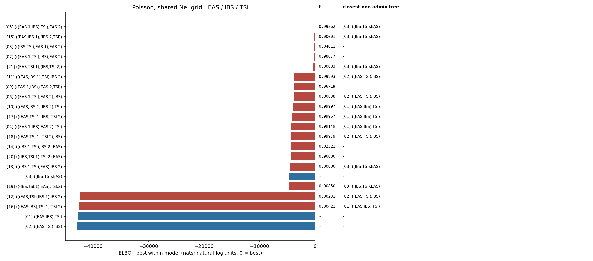

# Poisson, shared Ne, grid topology ranking

Populations: **EAS / IBS / TSI**

The weight is a softmax of Pathfinder ELBOs, not a posterior model probability.
Each topology is screened from dispersed MAP starts; distinct high-MAP modes are then fitted independently with Pathfinder. Search diagnostics are retained in `fit.json` and `elbo_table.csv`.
`f` is the fitted ancestry fraction from the first named source branch; tree topologies have no fraction. The closest tree is shown when `min(f, 1-f) < 0.01`.

| rank | topology | f | closest non-admix tree | ELBO | dELBO | ELBO weight |
|---|---|---:|---|---:|---:|---:|
| 1 | [`(((EAS.1,IBS),TSI),EAS.2)`](../../05_(((EAS.1,IBS),TSI),EAS.2)/poisson_grid_shared_ne/report.md) | 0.99262 | `[03] ((IBS,TSI),EAS)` | -540.7 | +0.0 | 1.0000 |
| 2 | [`((EAS,IBS.1),(IBS.2,TSI))`](../../15_((EAS,IBS.1),(IBS.2,TSI))/poisson_grid_shared_ne/report.md) | 0.00001 | `[03] ((IBS,TSI),EAS)` | -737.5 | -196.8 | 0.0000 |
| 3 | [`(((IBS,TSI),EAS.1),EAS.2)`](../../08_(((IBS,TSI),EAS.1),EAS.2)/poisson_grid_shared_ne/report.md) | 0.04011 | `-` | -753.7 | -213.0 | 0.0000 |
| 4 | [`(((EAS.1,TSI),IBS),EAS.2)`](../../07_(((EAS.1,TSI),IBS),EAS.2)/poisson_grid_shared_ne/report.md) | 0.98677 | `-` | -777.4 | -236.7 | 0.0000 |
| 5 | [`((EAS,TSI.1),(IBS,TSI.2))`](../../21_((EAS,TSI.1),(IBS,TSI.2))/poisson_grid_shared_ne/report.md) | 0.00083 | `[03] ((IBS,TSI),EAS)` | -882.7 | -342.0 | 0.0000 |
| 6 | [`(((EAS,IBS.1),TSI),IBS.2)`](../../11_(((EAS,IBS.1),TSI),IBS.2)/poisson_grid_shared_ne/report.md) | 0.99993 | `[02] ((EAS,TSI),IBS)` | -4354.6 | -3813.8 | 0.0000 |
| 7 | [`((EAS.1,IBS),(EAS.2,TSI))`](../../09_((EAS.1,IBS),(EAS.2,TSI))/poisson_grid_shared_ne/report.md) | 0.96719 | `-` | -4409.0 | -3868.3 | 0.0000 |
| 8 | [`(((EAS.1,TSI),EAS.2),IBS)`](../../06_(((EAS.1,TSI),EAS.2),IBS)/poisson_grid_shared_ne/report.md) | 0.00838 | `[02] ((EAS,TSI),IBS)` | -4441.0 | -3900.3 | 0.0000 |
| 9 | [`(((EAS,IBS.1),IBS.2),TSI)`](../../10_(((EAS,IBS.1),IBS.2),TSI)/poisson_grid_shared_ne/report.md) | 0.99997 | `[01] ((EAS,IBS),TSI)` | -4502.1 | -3961.4 | 0.0000 |
| 10 | [`(((EAS,TSI.1),IBS),TSI.2)`](../../17_(((EAS,TSI.1),IBS),TSI.2)/poisson_grid_shared_ne/report.md) | 0.99967 | `[01] ((EAS,IBS),TSI)` | -4789.4 | -4248.7 | 0.0000 |
| 11 | [`(((EAS.1,IBS),EAS.2),TSI)`](../../04_(((EAS.1,IBS),EAS.2),TSI)/poisson_grid_shared_ne/report.md) | 0.99149 | `[01] ((EAS,IBS),TSI)` | -4813.3 | -4272.6 | 0.0000 |
| 12 | [`(((EAS,TSI.1),TSI.2),IBS)`](../../18_(((EAS,TSI.1),TSI.2),IBS)/poisson_grid_shared_ne/report.md) | 0.99979 | `[02] ((EAS,TSI),IBS)` | -4815.8 | -4275.1 | 0.0000 |
| 13 | [`(((IBS.1,TSI),IBS.2),EAS)`](../../14_(((IBS.1,TSI),IBS.2),EAS)/poisson_grid_shared_ne/report.md) | 0.02521 | `-` | -4907.9 | -4367.2 | 0.0000 |
| 14 | [`(((IBS,TSI.1),TSI.2),EAS)`](../../20_(((IBS,TSI.1),TSI.2),EAS)/poisson_grid_shared_ne/report.md) | 0.90080 | `-` | -4925.7 | -4385.0 | 0.0000 |
| 15 | [`(((IBS.1,TSI),EAS),IBS.2)`](../../13_(((IBS.1,TSI),EAS),IBS.2)/poisson_grid_shared_ne/report.md) | 0.00000 | `[03] ((IBS,TSI),EAS)` | -5094.0 | -4553.3 | 0.0000 |
| 16 | [`((IBS,TSI),EAS)`](../../03_((IBS,TSI),EAS)/poisson_grid_shared_ne/report.md) | - | `-` | -5239.1 | -4698.4 | 0.0000 |
| 17 | [`(((IBS,TSI.1),EAS),TSI.2)`](../../19_(((IBS,TSI.1),EAS),TSI.2)/poisson_grid_shared_ne/report.md) | 0.00850 | `[03] ((IBS,TSI),EAS)` | -5247.6 | -4706.9 | 0.0000 |
| 18 | [`(((EAS,TSI),IBS.1),IBS.2)`](../../12_(((EAS,TSI),IBS.1),IBS.2)/poisson_grid_shared_ne/report.md) | 0.00231 | `[02] ((EAS,TSI),IBS)` | -42858.8 | -42318.0 | 0.0000 |
| 19 | [`(((EAS,IBS),TSI.1),TSI.2)`](../../16_(((EAS,IBS),TSI.1),TSI.2)/poisson_grid_shared_ne/report.md) | 0.00421 | `[01] ((EAS,IBS),TSI)` | -43130.4 | -42589.7 | 0.0000 |
| 20 | [`((EAS,IBS),TSI)`](../../01_((EAS,IBS),TSI)/poisson_grid_shared_ne/report.md) | - | `-` | -43210.0 | -42669.3 | 0.0000 |
| 21 | [`((EAS,TSI),IBS)`](../../02_((EAS,TSI),IBS)/poisson_grid_shared_ne/report.md) | - | `-` | -43401.1 | -42860.4 | 0.0000 |

