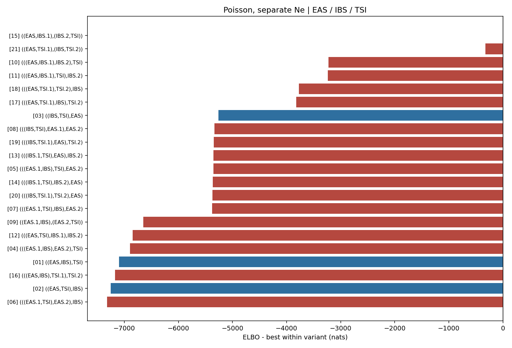

# Poisson, separate Ne topology ranking

Populations: **EAS / IBS / TSI**

The weight is a softmax of Pathfinder ELBOs, not a posterior model probability.

| rank | topology | ELBO | dELBO | ELBO weight |
|---|---|---:|---:|---:|
| 1 | [`((EAS,IBS.1),(IBS.2,TSI))`](../../15_((EAS,IBS.1),(IBS.2,TSI))/poisson_separate_ne/report.md) | -523.6 | +0.0 | 1.0000 |
| 2 | [`((EAS,TSI.1),(IBS,TSI.2))`](../../21_((EAS,TSI.1),(IBS,TSI.2))/poisson_separate_ne/report.md) | -850.8 | -327.2 | 0.0000 |
| 3 | [`(((EAS,IBS.1),IBS.2),TSI)`](../../10_(((EAS,IBS.1),IBS.2),TSI)/poisson_separate_ne/report.md) | -3747.4 | -3223.8 | 0.0000 |
| 4 | [`(((EAS,IBS.1),TSI),IBS.2)`](../../11_(((EAS,IBS.1),TSI),IBS.2)/poisson_separate_ne/report.md) | -3759.7 | -3236.1 | 0.0000 |
| 5 | [`(((EAS,TSI.1),TSI.2),IBS)`](../../18_(((EAS,TSI.1),TSI.2),IBS)/poisson_separate_ne/report.md) | -4298.1 | -3774.5 | 0.0000 |
| 6 | [`(((EAS,TSI.1),IBS),TSI.2)`](../../17_(((EAS,TSI.1),IBS),TSI.2)/poisson_separate_ne/report.md) | -4345.6 | -3822.0 | 0.0000 |
| 7 | [`((IBS,TSI),EAS)`](../../03_((IBS,TSI),EAS)/poisson_separate_ne/report.md) | -5783.4 | -5259.8 | 0.0000 |
| 8 | [`(((IBS,TSI),EAS.1),EAS.2)`](../../08_(((IBS,TSI),EAS.1),EAS.2)/poisson_separate_ne/report.md) | -5860.6 | -5337.0 | 0.0000 |
| 9 | [`(((IBS,TSI.1),EAS),TSI.2)`](../../19_(((IBS,TSI.1),EAS),TSI.2)/poisson_separate_ne/report.md) | -5870.5 | -5346.9 | 0.0000 |
| 10 | [`(((IBS.1,TSI),EAS),IBS.2)`](../../13_(((IBS.1,TSI),EAS),IBS.2)/poisson_separate_ne/report.md) | -5877.3 | -5353.7 | 0.0000 |
| 11 | [`(((EAS.1,IBS),TSI),EAS.2)`](../../05_(((EAS.1,IBS),TSI),EAS.2)/poisson_separate_ne/report.md) | -5879.0 | -5355.4 | 0.0000 |
| 12 | [`(((IBS.1,TSI),IBS.2),EAS)`](../../14_(((IBS.1,TSI),IBS.2),EAS)/poisson_separate_ne/report.md) | -5888.3 | -5364.7 | 0.0000 |
| 13 | [`(((IBS,TSI.1),TSI.2),EAS)`](../../20_(((IBS,TSI.1),TSI.2),EAS)/poisson_separate_ne/report.md) | -5893.7 | -5370.1 | 0.0000 |
| 14 | [`(((EAS.1,TSI),IBS),EAS.2)`](../../07_(((EAS.1,TSI),IBS),EAS.2)/poisson_separate_ne/report.md) | -5900.4 | -5376.8 | 0.0000 |
| 15 | [`((EAS.1,IBS),(EAS.2,TSI))`](../../09_((EAS.1,IBS),(EAS.2,TSI))/poisson_separate_ne/report.md) | -7175.0 | -6651.4 | 0.0000 |
| 16 | [`(((EAS,TSI),IBS.1),IBS.2)`](../../12_(((EAS,TSI),IBS.1),IBS.2)/poisson_separate_ne/report.md) | -7371.3 | -6847.7 | 0.0000 |
| 17 | [`(((EAS.1,IBS),EAS.2),TSI)`](../../04_(((EAS.1,IBS),EAS.2),TSI)/poisson_separate_ne/report.md) | -7420.8 | -6897.2 | 0.0000 |
| 18 | [`((EAS,IBS),TSI)`](../../01_((EAS,IBS),TSI)/poisson_separate_ne/report.md) | -7620.8 | -7097.2 | 0.0000 |
| 19 | [`(((EAS,IBS),TSI.1),TSI.2)`](../../16_(((EAS,IBS),TSI.1),TSI.2)/poisson_separate_ne/report.md) | -7694.8 | -7171.3 | 0.0000 |
| 20 | [`((EAS,TSI),IBS)`](../../02_((EAS,TSI),IBS)/poisson_separate_ne/report.md) | -7773.4 | -7249.8 | 0.0000 |
| 21 | [`(((EAS.1,TSI),EAS.2),IBS)`](../../06_(((EAS.1,TSI),EAS.2),IBS)/poisson_separate_ne/report.md) | -7842.7 | -7319.1 | 0.0000 |

