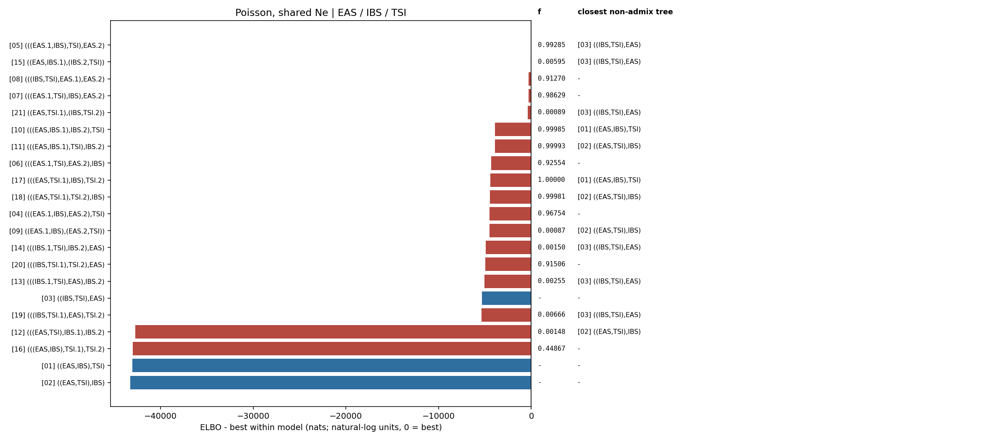

# Poisson, shared Ne topology ranking

Populations: **EAS / IBS / TSI**

The weight is a softmax of Pathfinder ELBOs, not a posterior model probability.
Each topology is screened from dispersed MAP starts; distinct high-MAP modes are then fitted independently with Pathfinder. Search diagnostics are retained in `fit.json` and `elbo_table.csv`.
`f` is the fitted ancestry fraction from the first named source branch; tree topologies have no fraction. The closest tree is shown when `min(f, 1-f) < 0.01`.

| rank | topology | f | closest non-admix tree | ELBO | dELBO | ELBO weight |
|---|---|---:|---|---:|---:|---:|
| 1 | [`(((EAS.1,IBS),TSI),EAS.2)`](../../05_(((EAS.1,IBS),TSI),EAS.2)/poisson_shared_ne/report.md) | 0.99285 | `[03] ((IBS,TSI),EAS)` | -523.1 | +0.0 | 1.0000 |
| 2 | [`((EAS,IBS.1),(IBS.2,TSI))`](../../15_((EAS,IBS.1),(IBS.2,TSI))/poisson_shared_ne/report.md) | 0.00595 | `[03] ((IBS,TSI),EAS)` | -598.9 | -75.8 | 0.0000 |
| 3 | [`(((IBS,TSI),EAS.1),EAS.2)`](../../08_(((IBS,TSI),EAS.1),EAS.2)/poisson_shared_ne/report.md) | 0.91270 | `-` | -795.6 | -272.5 | 0.0000 |
| 4 | [`(((EAS.1,TSI),IBS),EAS.2)`](../../07_(((EAS.1,TSI),IBS),EAS.2)/poisson_shared_ne/report.md) | 0.98629 | `-` | -803.1 | -280.0 | 0.0000 |
| 5 | [`((EAS,TSI.1),(IBS,TSI.2))`](../../21_((EAS,TSI.1),(IBS,TSI.2))/poisson_shared_ne/report.md) | 0.00089 | `[03] ((IBS,TSI),EAS)` | -901.9 | -378.8 | 0.0000 |
| 6 | [`(((EAS,IBS.1),IBS.2),TSI)`](../../10_(((EAS,IBS.1),IBS.2),TSI)/poisson_shared_ne/report.md) | 0.99985 | `[01] ((EAS,IBS),TSI)` | -4435.7 | -3912.6 | 0.0000 |
| 7 | [`(((EAS,IBS.1),TSI),IBS.2)`](../../11_(((EAS,IBS.1),TSI),IBS.2)/poisson_shared_ne/report.md) | 0.99993 | `[02] ((EAS,TSI),IBS)` | -4445.7 | -3922.7 | 0.0000 |
| 8 | [`(((EAS.1,TSI),EAS.2),IBS)`](../../06_(((EAS.1,TSI),EAS.2),IBS)/poisson_shared_ne/report.md) | 0.92554 | `-` | -4840.5 | -4317.4 | 0.0000 |
| 9 | [`(((EAS,TSI.1),IBS),TSI.2)`](../../17_(((EAS,TSI.1),IBS),TSI.2)/poisson_shared_ne/report.md) | 1.00000 | `[01] ((EAS,IBS),TSI)` | -4959.8 | -4436.7 | 0.0000 |
| 10 | [`(((EAS,TSI.1),TSI.2),IBS)`](../../18_(((EAS,TSI.1),TSI.2),IBS)/poisson_shared_ne/report.md) | 0.99981 | `[02] ((EAS,TSI),IBS)` | -4967.9 | -4444.9 | 0.0000 |
| 11 | [`(((EAS.1,IBS),EAS.2),TSI)`](../../04_(((EAS.1,IBS),EAS.2),TSI)/poisson_shared_ne/report.md) | 0.96754 | `-` | -5037.0 | -4513.9 | 0.0000 |
| 12 | [`((EAS.1,IBS),(EAS.2,TSI))`](../../09_((EAS.1,IBS),(EAS.2,TSI))/poisson_shared_ne/report.md) | 0.00087 | `[02] ((EAS,TSI),IBS)` | -5049.9 | -4526.8 | 0.0000 |
| 13 | [`(((IBS.1,TSI),IBS.2),EAS)`](../../14_(((IBS.1,TSI),IBS.2),EAS)/poisson_shared_ne/report.md) | 0.00150 | `[03] ((IBS,TSI),EAS)` | -5462.2 | -4939.1 | 0.0000 |
| 14 | [`(((IBS,TSI.1),TSI.2),EAS)`](../../20_(((IBS,TSI.1),TSI.2),EAS)/poisson_shared_ne/report.md) | 0.91506 | `-` | -5492.9 | -4969.8 | 0.0000 |
| 15 | [`(((IBS.1,TSI),EAS),IBS.2)`](../../13_(((IBS.1,TSI),EAS),IBS.2)/poisson_shared_ne/report.md) | 0.00255 | `[03] ((IBS,TSI),EAS)` | -5593.2 | -5070.1 | 0.0000 |
| 16 | [`((IBS,TSI),EAS)`](../../03_((IBS,TSI),EAS)/poisson_shared_ne/report.md) | - | `-` | -5834.2 | -5311.1 | 0.0000 |
| 17 | [`(((IBS,TSI.1),EAS),TSI.2)`](../../19_(((IBS,TSI.1),EAS),TSI.2)/poisson_shared_ne/report.md) | 0.00666 | `[03] ((IBS,TSI),EAS)` | -5881.3 | -5358.2 | 0.0000 |
| 18 | [`(((EAS,TSI),IBS.1),IBS.2)`](../../12_(((EAS,TSI),IBS.1),IBS.2)/poisson_shared_ne/report.md) | 0.00148 | `[02] ((EAS,TSI),IBS)` | -43239.6 | -42716.5 | 0.0000 |
| 19 | [`(((EAS,IBS),TSI.1),TSI.2)`](../../16_(((EAS,IBS),TSI.1),TSI.2)/poisson_shared_ne/report.md) | 0.44867 | `-` | -43514.2 | -42991.1 | 0.0000 |
| 20 | [`((EAS,IBS),TSI)`](../../01_((EAS,IBS),TSI)/poisson_shared_ne/report.md) | - | `-` | -43561.5 | -43038.4 | 0.0000 |
| 21 | [`((EAS,TSI),IBS)`](../../02_((EAS,TSI),IBS)/poisson_shared_ne/report.md) | - | `-` | -43785.5 | -43262.4 | 0.0000 |

