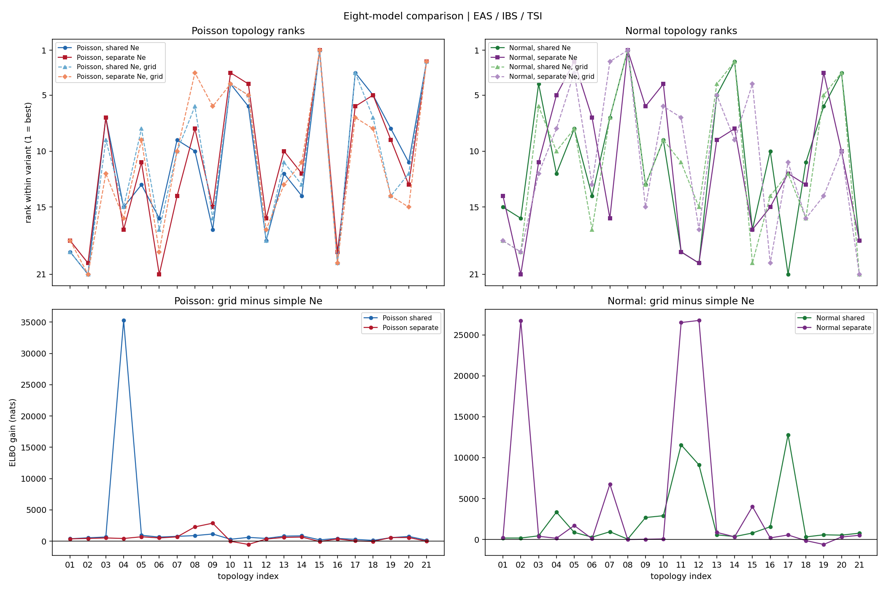

# Eight-model comparison on EAS / IBS / TSI

## Best topology within each variant

| variant | topology | ELBO | dELBO runner-up |
|---|---|---:|---:|
| Poisson, shared Ne | `((EAS,IBS.1),(IBS.2,TSI))` | -1013.0 | -45.3 |
| Poisson, separate Ne | `((EAS,IBS.1),(IBS.2,TSI))` | -523.6 | -327.2 |
| Normal, shared Ne | `(((IBS,TSI),EAS.1),EAS.2)` | +3869.0 | -3837.5 |
| Normal, separate Ne | `(((IBS,TSI),EAS.1),EAS.2)` | +3815.4 | -3119.3 |
| Poisson, shared Ne, grid | `((EAS,IBS.1),(IBS.2,TSI))` | -794.7 | -94.4 |
| Poisson, separate Ne, grid | `((EAS,IBS.1),(IBS.2,TSI))` | -574.1 | -269.3 |
| Normal, shared Ne, grid | `(((IBS,TSI),EAS.1),EAS.2)` | +3906.7 | -3522.1 |
| Normal, separate Ne, grid | `(((IBS,TSI),EAS.1),EAS.2)` | +3807.4 | -219.6 |

## Ne-model evidence gains

These differences are valid only within the same likelihood.

| likelihood | comparison | best-to-best gain | same winner? |
|---|---|---:|---:|
| Poisson | simple: separate - shared | +489.4 | yes |
| Poisson | grid: separate - shared | +220.7 | yes |
| Poisson | shared: grid - simple | +218.3 | yes |
| Poisson | separate: grid - simple | -50.5 | yes |
| Normal | simple: separate - shared | -53.6 | yes |
| Normal | grid: separate - shared | -99.3 | yes |
| Normal | shared: grid - simple | +37.7 | yes |
| Normal | separate: grid - simple | -8.0 | yes |

## Rank consistency

ELBO values are comparable between shared- and separate-Ne models within one likelihood, but not between Poisson and Normal because they are masses/densities for different observed summaries.

| comparison | Spearman rank correlation | top-5 overlap |
|---|---:|---:|
| Poisson simple: shared vs separate | +0.935 | 4/5 |
| Poisson grid: shared vs separate | +0.896 | 4/5 |
| Poisson shared: simple vs grid | +0.940 | 4/5 |
| Poisson separate: simple vs grid | +0.864 | 4/5 |
| Normal simple: shared vs separate | +0.621 | 1/5 |
| Normal grid: shared vs separate | +0.603 | 2/5 |
| Normal shared: simple vs grid | +0.827 | 4/5 |
| Normal separate: simple vs grid | +0.447 | 2/5 |
| Simple shared: Poisson vs Normal | -0.052 | 0/5 |
| Simple separate: Poisson vs Normal | +0.013 | 1/5 |
| Grid shared: Poisson vs Normal | +0.088 | 0/5 |
| Grid separate: Poisson vs Normal | +0.455 | 2/5 |

## Winner diagnostics

| variant | IBD chi2/n | SNP chi2/n | admixture fraction | interpretation |
|---|---:|---:|---:|---|
| Poisson, shared Ne | 20.68 | 6.12 | 0.0000 | collapsed/near-tree |
| Poisson, separate Ne | 1.05 | 2.50 | 0.0064 | collapsed/near-tree |
| Normal, shared Ne | 3.64 | 4.75 | 0.7847 | non-boundary admixture |
| Normal, separate Ne | 3.64 | 3.15 | 0.7212 | non-boundary admixture |
| Poisson, shared Ne, grid | 15.83 | 2.21 | 0.0071 | collapsed/near-tree |
| Poisson, separate Ne, grid | 0.88 | 2.29 | 0.0050 | collapsed/near-tree |
| Normal, shared Ne, grid | 3.13 | 4.29 | 0.8057 | non-boundary admixture |
| Normal, separate Ne, grid | 3.12 | 1.21 | 0.7884 | non-boundary admixture |

## Recent Ne in grid-model winners

The ratio is Ne(0-5 generations) / Ne(5-10 generations); values above one indicate growth toward the present.

| variant | component | population | Ne 0-5 | Ne 5-10 | ratio | first event |
|---|---|---|---:|---:|---:|---:|
| Poisson, shared Ne, grid | shared | EAS | 10489924 | 7903449 | 1.33 | 71.9 |
| Poisson, shared Ne, grid | shared | IBS | 1311696 | 1168243 | 1.12 | 71.9 |
| Poisson, shared Ne, grid | shared | TSI | 1289283 | 939094 | 1.37 | 71.9 |
| Poisson, separate Ne, grid | IBD | EAS | 4220485 | 3865573 | 1.09 | 86.6 |
| Poisson, separate Ne, grid | IBD | IBS | 1631897 | 1371699 | 1.19 | 86.6 |
| Poisson, separate Ne, grid | IBD | TSI | 1029885 | 804162 | 1.28 | 86.6 |
| Poisson, separate Ne, grid | SNP | EAS | 1886 | 1841 | 1.02 | 86.6 |
| Poisson, separate Ne, grid | SNP | IBS | 82327 | 81489 | 1.01 | 86.6 |
| Poisson, separate Ne, grid | SNP | TSI | 164135 | 159540 | 1.03 | 86.6 |
| Normal, shared Ne, grid | shared | EAS | 4627924 | 4072906 | 1.14 | 131.9 |
| Normal, shared Ne, grid | shared | IBS | 2158099 | 1478195 | 1.46 | 131.9 |
| Normal, shared Ne, grid | shared | TSI | 894165 | 712488 | 1.25 | 131.9 |
| Normal, separate Ne, grid | IBD | EAS | 4600946 | 4121105 | 1.12 | 131.1 |
| Normal, separate Ne, grid | IBD | IBS | 2268689 | 1579124 | 1.44 | 131.1 |
| Normal, separate Ne, grid | IBD | TSI | 1051781 | 795414 | 1.32 | 131.1 |
| Normal, separate Ne, grid | SNP | EAS | 6243 | 6115 | 1.02 | 131.1 |
| Normal, separate Ne, grid | SNP | IBS | 156281 | 146914 | 1.06 | 131.1 |
| Normal, separate Ne, grid | SNP | TSI | 114032 | 109831 | 1.04 | 131.1 |

## Interpretation

Poisson and Normal ELBO levels are not subtracted from each other: the two likelihoods are densities/masses for different summaries and therefore use different base measures and units. Compare their topology ranks, residuals, and shared-versus-separate-Ne gains instead.

The data contain **116/222 empty unique pair-by-bin cells**. The winning grid separate-Ne Normal fit places 75/222 unique cells at its hard `1e-12` theory-SE floor. Consequently, its all-bin CLT likelihood is being used most aggressively exactly where the CLT is least justified.

The Poisson winner has admixture fraction **0.0050**. It is therefore best read as a near-tree model with an extra branch breakpoint if the fraction remains near a boundary, not as evidence for substantial admixture.

The grid comparison directly tests whether 0-10 generation growth explains the topology preference. Rank agreement and the winner-fraction diagnostics above should be considered together; a high ELBO for boundary admixture is evidence for remaining Ne misspecification rather than for gene flow.

## Conclusion

All four Poisson variants select topology 15, and all four Normal variants select topology 8. The recent grid therefore does not reconcile the two likelihoods or change either likelihood's winner.

The grid separate-Ne Poisson winner has IBD chi2/n **0.88** but fraction **0.0050**. Its good count calibration does not turn that boundary edge into admixture evidence; the graph is acting as a tree with an additional branch-specific Ne change.

The grid separate-Ne Normal winner retains a non-boundary fraction **0.7884**, but its IBD chi2/n is **3.12** and 75/222 cells use the variance floor. Its topology result is therefore sensitivity evidence, not a reliable resolution of the Poisson result.

The next misspecification test should use fixed absolute Ne breakpoints beyond generation 10 and truncate each branch trajectory at its event time. That lets events occur inside the grid, avoiding an artificial lower bound on the first event while testing whether the near-tree admixture edge disappears.
