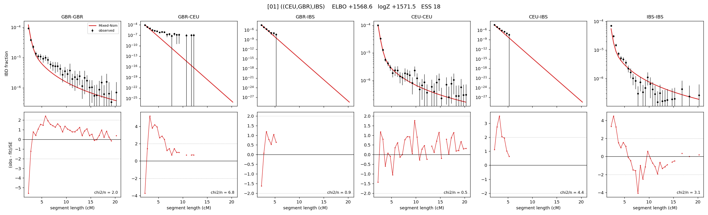

# `((CEU,GBR),IBS)`

Model 01 of 21 | tree (no admixture) | 2 events, 5 nodes

## Model score

| quantity | value | |
|---|---|---|
| ELBO | +1568.56 | +- 0.06 (MC) |
| logZ (importance sampling) | +1571.46 | |
| ESS of the IS weights | 17.8 / 4000 | LOW -- treat logZ with suspicion |
| Stan dropped-constant correction | -13.81 | already applied |
| seed kept / runtime | 1 | 6 s |

## Events (in temporal order, most recent first)

| # | type | detail | time (gen) | cumulative |
|---|---|---|---|---|
| 1 | MERGE | GBR + CEU -> n1 | 141.6 +- 0.7 | 141.6 |
| 2 | MERGE | n1 + IBS -> root | 12.1 +- 0.7 | 153.6 |

## Effective sizes (haploid)

| node | Ne | sd of log Ne |
|---|---|---|
| `GBR` | 321,901 | 0.07 |
| `CEU` | 744,518 | 0.08 |
| `IBS` | 657,971 | 0.08 |
| `n1` | 3,327 | 0.06 |
| `root` | 8,361 | 0.05 |

log-Ne random-walk step scale tau = 1.503

## Fit quality by component

| component | log-likelihood | n terms | chi2/n |
|---|---|---|---|
| IBD | +1,585.4 | 132 | 2.61 |
| SNP | +53.0 | 6 | 1.60 |

chi2/n is the mean squared standardized residual: 1.0 = fits inside its own SEs. Do NOT compare the two log-likelihood LEVELS against each other -- different term counts and different units.

## SNP covariance residuals `(w_hat - W_pred)/w_se`

| | GBR | CEU | IBS |
|---|---|---|---|
| **GBR** | -0.60 | +1.94 | -0.92 |
| **CEU** | +1.94 | -0.62 | -0.65 |
| **IBS** | -0.92 | -0.65 | +0.99 |

