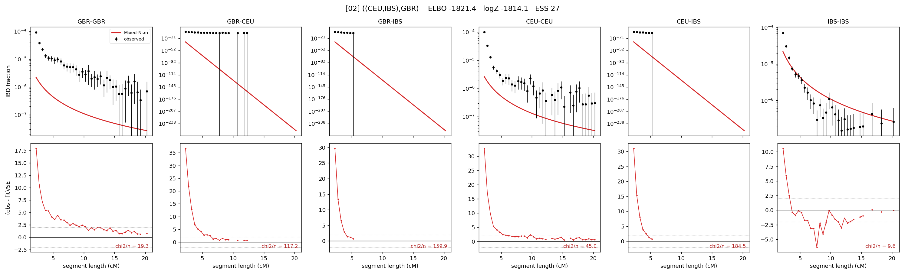

# `((CEU,IBS),GBR)`

Model 02 of 21 | tree (no admixture) | 2 events, 5 nodes

## Model score

| quantity | value | |
|---|---|---|
| ELBO | -1821.43 | +- 0.28 (MC) |
| logZ (importance sampling) | -1814.06 | |
| ESS of the IS weights | 27.3 / 4000 | LOW -- treat logZ with suspicion |
| Stan dropped-constant correction | -13.81 | already applied |
| seed kept / runtime | 13 | 8 s |

## Events (in temporal order, most recent first)

| # | type | detail | time (gen) | cumulative |
|---|---|---|---|---|
| 1 | MERGE | CEU + IBS -> n1 | 1,752.9 +- 77.1 | 1,752.9 |
| 2 | MERGE | GBR + n1 -> root | 1.8 +- 0.6 | 1,754.7 |

## Effective sizes (haploid)

| node | Ne | sd of log Ne |
|---|---|---|
| `GBR` | 4,647,214 | 0.16 |
| `CEU` | 3,878,421 | 0.17 |
| `IBS` | 459,675 | 0.05 |
| `n1` | 68,973 | 0.26 |
| `root` | 67,822 | 0.27 |

log-Ne random-walk step scale tau = 0.675

## Fit quality by component

| component | log-likelihood | n terms | chi2/n |
|---|---|---|---|
| IBD | -1,777.7 | 132 | 53.56 |
| SNP | +20.2 | 6 | 12.54 |

chi2/n is the mean squared standardized residual: 1.0 = fits inside its own SEs. Do NOT compare the two log-likelihood LEVELS against each other -- different term counts and different units.

## SNP covariance residuals `(w_hat - W_pred)/w_se`

| | GBR | CEU | IBS |
|---|---|---|---|
| **GBR** | -1.11 | +5.19 | -2.99 |
| **CEU** | +5.19 | -4.93 | +1.12 |
| **IBS** | -2.99 | +1.12 | +0.86 |

