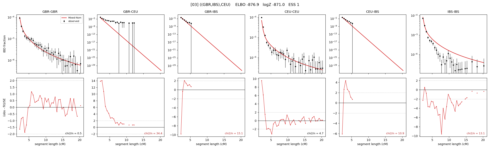

# `((GBR,IBS),CEU)`

Model 03 of 21 | tree (no admixture) | 2 events, 5 nodes

## Model score

| quantity | value | |
|---|---|---|
| ELBO | -876.89 | +- 0.17 (MC) |
| logZ (importance sampling) | -870.98 | |
| ESS of the IS weights | 1.4 / 4000 | LOW -- treat logZ with suspicion |
| Stan dropped-constant correction | -13.81 | already applied |
| seed kept / runtime | 13 | 10 s |

## Events (in temporal order, most recent first)

| # | type | detail | time (gen) | cumulative |
|---|---|---|---|---|
| 1 | MERGE | GBR + IBS -> n1 | 173.9 +- 2.7 | 173.9 |
| 2 | MERGE | n1 + CEU -> root | 1.0 +- 0.0 | 174.9 |

## Effective sizes (haploid)

| node | Ne | sd of log Ne |
|---|---|---|
| `GBR` | 202,945 | 0.04 |
| `CEU` | 494,577 | 0.05 |
| `IBS` | 321,549 | 0.04 |
| `n1` | 6,795 | 0.10 |
| `root` | 3,322 | 0.09 |

log-Ne random-walk step scale tau = 1.640

## Fit quality by component

| component | log-likelihood | n terms | chi2/n |
|---|---|---|---|
| IBD | +1,058.4 | 132 | 10.40 |
| SNP | -1,854.6 | 6 | 637.45 |

chi2/n is the mean squared standardized residual: 1.0 = fits inside its own SEs. Do NOT compare the two log-likelihood LEVELS against each other -- different term counts and different units.

## SNP covariance residuals `(w_hat - W_pred)/w_se`

| | GBR | CEU | IBS |
|---|---|---|---|
| **GBR** | +5.59 | +31.00 | -30.65 |
| **CEU** | +31.00 | +6.34 | -24.81 |
| **IBS** | -30.65 | -24.81 | +35.15 |

