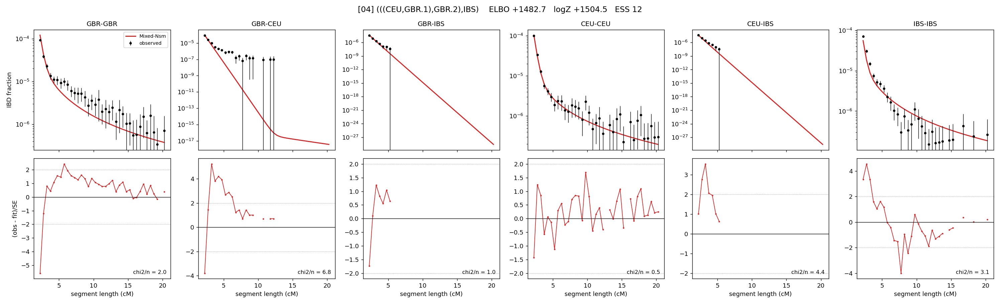

# `(((CEU,GBR.1),GBR.2),IBS)`

Model 04 of 21 | admixed leaf: **GBR** | 4 events, 8 nodes

## Model score

| quantity | value | |
|---|---|---|
| ELBO | +1482.74 | +- 0.42 (MC) |
| logZ (importance sampling) | +1504.48 | |
| ESS of the IS weights | 12.0 / 4000 | LOW -- treat logZ with suspicion |
| Stan dropped-constant correction | -25.77 | already applied |
| seed kept / runtime | 13 | 22 s |

## Events (in temporal order, most recent first)

| # | type | detail | time (gen) | cumulative |
|---|---|---|---|---|
| 1 | ADMIXTURE | GBR -> GBR.1 + GBR.2 | 1.0 +- 0.0 | 1.0 |
| 2 | MERGE | GBR.2 + CEU -> n1 | 12.3 +- 0.7 | 13.3 |
| 3 | MERGE | GBR.1 + n1 -> n2 | 128.0 +- 0.8 | 141.3 |
| 4 | MERGE | n2 + IBS -> root | 12.9 +- 0.7 | 154.2 |

## Admixture fraction

**f = 1.000 +- 0.000** (fraction from `GBR.1`; 0.000 from `GBR.2`)

Collapsed to a tree: one source carries <5% of the ancestry, so this graph is behaving as its no-admixture special case.

## Effective sizes (haploid)

| node | Ne | sd of log Ne |
|---|---|---|
| `GBR` | 326,236 | 0.13 |
| `CEU` | 631,461 | 0.19 |
| `IBS` | 694,504 | 0.21 |
| `GBR.1` | 326,755 | 0.13 |
| `GBR.2` | 777,864 | 0.19 |
| `n1` | 784,566 | 0.19 |
| `n2` | 3,544 | 0.05 |
| `root` | 8,205 | 0.06 |

log-Ne random-walk step scale tau = 1.557

## Fit quality by component

| component | log-likelihood | n terms | chi2/n |
|---|---|---|---|
| IBD | +1,569.1 | 132 | 2.85 |
| SNP | +50.0 | 6 | 2.61 |

chi2/n is the mean squared standardized residual: 1.0 = fits inside its own SEs. Do NOT compare the two log-likelihood LEVELS against each other -- different term counts and different units.

## SNP covariance residuals `(w_hat - W_pred)/w_se`

| | GBR | CEU | IBS |
|---|---|---|---|
| **GBR** | -0.63 | +1.81 | -0.79 |
| **CEU** | +1.81 | -0.68 | -0.53 |
| **IBS** | -0.79 | -0.53 | +0.83 |

