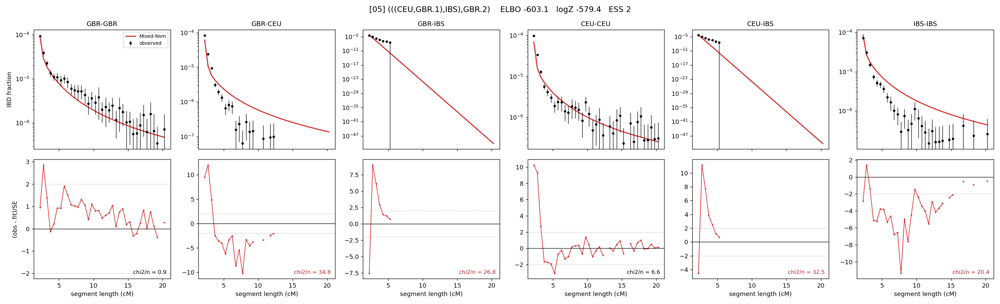

# `(((CEU,GBR.1),IBS),GBR.2)`

Model 05 of 21 | admixed leaf: **GBR** | 4 events, 8 nodes

## Model score

| quantity | value | |
|---|---|---|
| ELBO | -603.15 | +- 0.40 (MC) |
| logZ (importance sampling) | -579.36 | |
| ESS of the IS weights | 2.2 / 4000 | LOW -- treat logZ with suspicion |
| Stan dropped-constant correction | -25.77 | already applied |
| seed kept / runtime | 7 | 24 s |

## Events (in temporal order, most recent first)

| # | type | detail | time (gen) | cumulative |
|---|---|---|---|---|
| 1 | ADMIXTURE | GBR -> GBR.1 + GBR.2 | 1.0 +- 0.0 | 1.0 |
| 2 | MERGE | GBR.2 + CEU -> n1 | 1.0 +- 0.0 | 2.0 |
| 3 | MERGE | n1 + IBS -> n2 | 290.3 +- 2.1 | 292.3 |
| 4 | MERGE | GBR.1 + n2 -> root | 4.5 +- 1.8 | 296.8 |

## Admixture fraction

**f = 0.400 +- 0.063** (fraction from `GBR.1`; 0.600 from `GBR.2`)

## Effective sizes (haploid)

| node | Ne | sd of log Ne |
|---|---|---|
| `GBR` | 171,038 | 0.10 |
| `CEU` | 277,384 | 0.09 |
| `IBS` | 276,910 | 0.06 |
| `GBR.1` | 51,836 | 0.24 |
| `GBR.2` | 444,138 | 0.09 |
| `n1` | 505,333 | 0.09 |
| `n2` | 6,670 | 1.08 |
| `root` | 20 | 0.35 |

log-Ne random-walk step scale tau = 2.444

## Fit quality by component

| component | log-likelihood | n terms | chi2/n |
|---|---|---|---|
| IBD | +735.9 | 132 | 14.51 |
| SNP | -1,016.5 | 6 | 358.12 |

chi2/n is the mean squared standardized residual: 1.0 = fits inside its own SEs. Do NOT compare the two log-likelihood LEVELS against each other -- different term counts and different units.

## SNP covariance residuals `(w_hat - W_pred)/w_se`

| | GBR | CEU | IBS |
|---|---|---|---|
| **GBR** | +0.42 | +24.10 | -19.71 |
| **CEU** | +24.10 | +6.68 | -20.83 |
| **IBS** | -19.71 | -20.83 | +26.14 |

