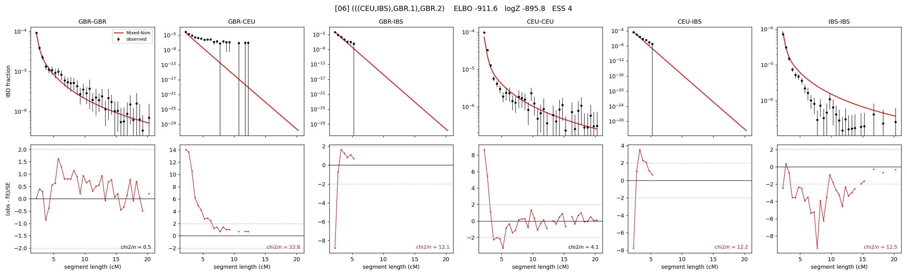

# `(((CEU,IBS),GBR.1),GBR.2)`

Model 06 of 21 | admixed leaf: **GBR** | 4 events, 8 nodes

> Graph where the two NON-admixed leaves merge first. Excluded by the 'first merge must involve an admixture branch' rule; included here because it is the standard local-clade + deep-source scenario.

## Model score

| quantity | value | |
|---|---|---|
| ELBO | -911.55 | +- 0.24 (MC) |
| logZ (importance sampling) | -895.84 | |
| ESS of the IS weights | 3.8 / 4000 | LOW -- treat logZ with suspicion |
| Stan dropped-constant correction | -25.77 | already applied |
| seed kept / runtime | 31 | 24 s |

## Events (in temporal order, most recent first)

| # | type | detail | time (gen) | cumulative |
|---|---|---|---|---|
| 1 | ADMIXTURE | GBR -> GBR.1 + GBR.2 | 1.0 +- 0.0 | 1.0 |
| 2 | MERGE | CEU + IBS -> n1 | 166.0 +- 1.7 | 167.0 |
| 3 | MERGE | GBR.2 + n1 -> n2 | 1.2 +- 0.2 | 168.1 |
| 4 | MERGE | GBR.1 + n2 -> root | 1.0 +- 0.0 | 169.2 |

## Admixture fraction

**f = 0.829 +- 0.013** (fraction from `GBR.1`; 0.171 from `GBR.2`)

## Effective sizes (haploid)

| node | Ne | sd of log Ne |
|---|---|---|
| `GBR` | 181,814 | 0.09 |
| `CEU` | 496,015 | 0.15 |
| `IBS` | 328,637 | 0.08 |
| `GBR.1` | 305,452 | 0.10 |
| `GBR.2` | 14,922 | 0.13 |
| `n1` | 5,608 | 0.06 |
| `n2` | 4,701 | 0.06 |
| `root` | 4,085 | 0.06 |

log-Ne random-walk step scale tau = 1.197

## Fit quality by component

| component | log-likelihood | n terms | chi2/n |
|---|---|---|---|
| IBD | +1,084.1 | 132 | 10.02 |
| SNP | -1,873.7 | 6 | 643.83 |

chi2/n is the mean squared standardized residual: 1.0 = fits inside its own SEs. Do NOT compare the two log-likelihood LEVELS against each other -- different term counts and different units.

## SNP covariance residuals `(w_hat - W_pred)/w_se`

| | GBR | CEU | IBS |
|---|---|---|---|
| **GBR** | +2.36 | +31.88 | -27.97 |
| **CEU** | +31.88 | +8.36 | -27.14 |
| **IBS** | -27.97 | -27.14 | +35.33 |

