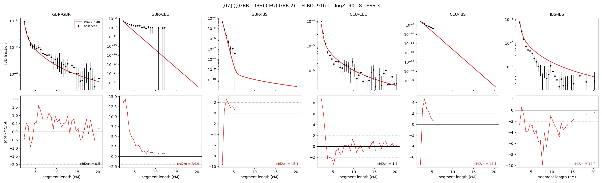

# `(((GBR.1,IBS),CEU),GBR.2)`

Model 07 of 21 | admixed leaf: **GBR** | 4 events, 8 nodes

## Model score

| quantity | value | |
|---|---|---|
| ELBO | -916.08 | +- 0.18 (MC) |
| logZ (importance sampling) | -901.79 | |
| ESS of the IS weights | 2.8 / 4000 | LOW -- treat logZ with suspicion |
| Stan dropped-constant correction | -25.77 | already applied |
| seed kept / runtime | 1 | 24 s |

## Events (in temporal order, most recent first)

| # | type | detail | time (gen) | cumulative |
|---|---|---|---|---|
| 1 | ADMIXTURE | GBR -> GBR.1 + GBR.2 | 1.0 +- 0.0 | 1.0 |
| 2 | MERGE | GBR.2 + IBS -> n1 | 2.8 +- 0.1 | 3.8 |
| 3 | MERGE | n1 + CEU -> n2 | 176.3 +- 1.3 | 180.2 |
| 4 | MERGE | GBR.1 + n2 -> root | 1.0 +- 0.0 | 181.2 |

## Admixture fraction

**f = 1.000 +- 0.000** (fraction from `GBR.1`; 0.000 from `GBR.2`)

Collapsed to a tree: one source carries <5% of the ancestry, so this graph is behaving as its no-admixture special case.

## Effective sizes (haploid)

| node | Ne | sd of log Ne |
|---|---|---|
| `GBR` | 233,923 | 0.09 |
| `CEU` | 481,877 | 0.05 |
| `IBS` | 334,772 | 0.07 |
| `GBR.1` | 233,900 | 0.09 |
| `GBR.2` | 316,972 | 0.06 |
| `n1` | 314,949 | 0.06 |
| `n2` | 4,012 | 0.03 |
| `root` | 2,647 | 0.02 |

log-Ne random-walk step scale tau = 1.300

## Fit quality by component

| component | log-likelihood | n terms | chi2/n |
|---|---|---|---|
| IBD | +1,031.5 | 132 | 10.81 |
| SNP | -1,805.8 | 6 | 621.20 |

chi2/n is the mean squared standardized residual: 1.0 = fits inside its own SEs. Do NOT compare the two log-likelihood LEVELS against each other -- different term counts and different units.

## SNP covariance residuals `(w_hat - W_pred)/w_se`

| | GBR | CEU | IBS |
|---|---|---|---|
| **GBR** | +2.91 | +31.24 | -28.02 |
| **CEU** | +31.24 | +7.79 | -26.24 |
| **IBS** | -28.02 | -26.24 | +34.71 |

