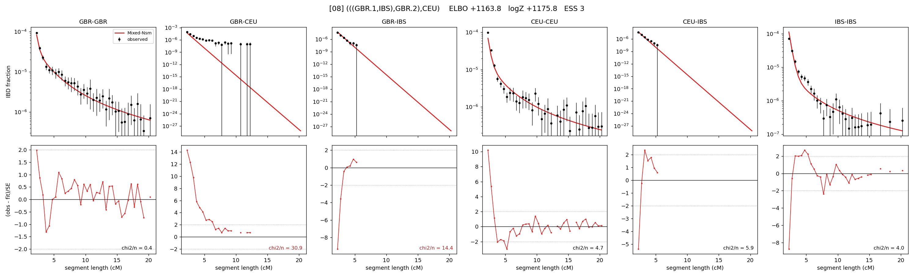

# `(((GBR.1,IBS),GBR.2),CEU)`

Model 08 of 21 | admixed leaf: **GBR** | 4 events, 8 nodes

## Model score

| quantity | value | |
|---|---|---|
| ELBO | +1163.82 | +- 0.18 (MC) |
| logZ (importance sampling) | +1175.80 | |
| ESS of the IS weights | 3.2 / 4000 | LOW -- treat logZ with suspicion |
| Stan dropped-constant correction | -25.77 | already applied |
| seed kept / runtime | 31 | 22 s |

## Events (in temporal order, most recent first)

| # | type | detail | time (gen) | cumulative |
|---|---|---|---|---|
| 1 | ADMIXTURE | GBR -> GBR.1 + GBR.2 | 63.6 +- 0.6 | 63.6 |
| 2 | MERGE | GBR.2 + IBS -> n1 | 78.5 +- 0.8 | 142.1 |
| 3 | MERGE | GBR.1 + n1 -> n2 | 9.0 +- 0.2 | 151.1 |
| 4 | MERGE | n2 + CEU -> root | 1.0 +- 0.0 | 152.1 |

## Admixture fraction

**f = 0.999 +- 0.000** (fraction from `GBR.1`; 0.001 from `GBR.2`)

Collapsed to a tree: one source carries <5% of the ancestry, so this graph is behaving as its no-admixture special case.

## Effective sizes (haploid)

| node | Ne | sd of log Ne |
|---|---|---|
| `GBR` | 195,537 | 0.08 |
| `CEU` | 509,790 | 0.06 |
| `IBS` | 989,632 | 0.18 |
| `GBR.1` | 1,337,569 | 0.08 |
| `GBR.2` | 1,609 | 0.16 |
| `n1` | 2,422 | 0.03 |
| `n2` | 10,894 | 0.03 |
| `root` | 7,213 | 0.03 |

log-Ne random-walk step scale tau = 1.655

## Fit quality by component

| component | log-likelihood | n terms | chi2/n |
|---|---|---|---|
| IBD | +1,252.7 | 132 | 7.66 |
| SNP | +35.4 | 6 | 7.46 |

chi2/n is the mean squared standardized residual: 1.0 = fits inside its own SEs. Do NOT compare the two log-likelihood LEVELS against each other -- different term counts and different units.

## SNP covariance residuals `(w_hat - W_pred)/w_se`

| | GBR | CEU | IBS |
|---|---|---|---|
| **GBR** | -0.57 | +3.80 | -2.44 |
| **CEU** | +3.80 | -3.90 | +1.08 |
| **IBS** | -2.44 | +1.08 | +0.59 |

