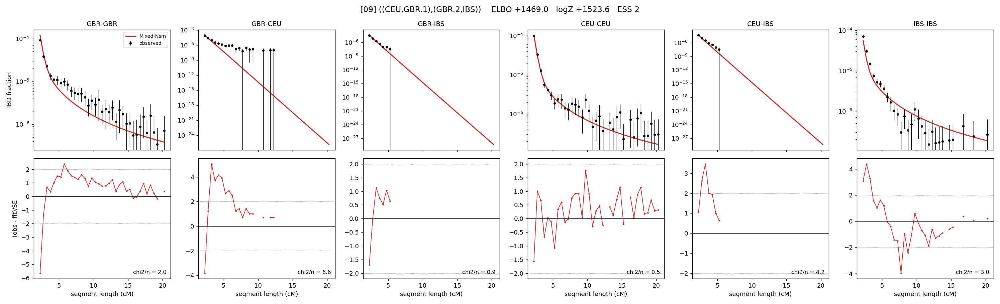

# `((CEU,GBR.1),(GBR.2,IBS))`

Model 09 of 21 | admixed leaf: **GBR** | 4 events, 8 nodes

## Model score

| quantity | value | |
|---|---|---|
| ELBO | +1469.03 | +- 1.12 (MC) |
| logZ (importance sampling) | +1523.64 | |
| ESS of the IS weights | 1.5 / 4000 | LOW -- treat logZ with suspicion |
| Stan dropped-constant correction | -25.77 | already applied |
| seed kept / runtime | 7 | 23 s |

## Events (in temporal order, most recent first)

| # | type | detail | time (gen) | cumulative |
|---|---|---|---|---|
| 1 | ADMIXTURE | GBR -> GBR.1 + GBR.2 | 1.0 +- 0.0 | 1.0 |
| 2 | MERGE | GBR.1 + CEU -> n1 | 139.2 +- 1.9 | 140.2 |
| 3 | MERGE | GBR.2 + IBS -> n2 | 12.1 +- 2.3 | 152.2 |
| 4 | MERGE | n1 + n2 -> root | 1.0 +- 0.0 | 153.3 |

## Admixture fraction

**f = 0.998 +- 0.002** (fraction from `GBR.1`; 0.002 from `GBR.2`)

Collapsed to a tree: one source carries <5% of the ancestry, so this graph is behaving as its no-admixture special case.

## Effective sizes (haploid)

| node | Ne | sd of log Ne |
|---|---|---|
| `GBR` | 320,640 | 0.17 |
| `CEU` | 767,703 | 0.21 |
| `IBS` | 701,856 | 0.23 |
| `GBR.1` | 324,829 | 0.17 |
| `GBR.2` | 6,538 | 0.11 |
| `n1` | 3,709 | 0.17 |
| `n2` | 8,495 | 0.11 |
| `root` | 8,464 | 0.05 |

log-Ne random-walk step scale tau = 1.476

## Fit quality by component

| component | log-likelihood | n terms | chi2/n |
|---|---|---|---|
| IBD | +1,560.9 | 132 | 2.98 |
| SNP | +40.2 | 6 | 5.87 |

chi2/n is the mean squared standardized residual: 1.0 = fits inside its own SEs. Do NOT compare the two log-likelihood LEVELS against each other -- different term counts and different units.

## SNP covariance residuals `(w_hat - W_pred)/w_se`

| | GBR | CEU | IBS |
|---|---|---|---|
| **GBR** | -0.64 | +1.77 | -0.75 |
| **CEU** | +1.77 | -0.82 | -0.38 |
| **IBS** | -0.75 | -0.38 | +0.69 |

