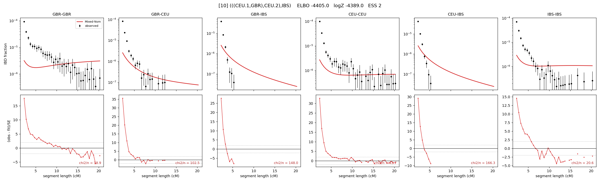

# `(((CEU.1,GBR),CEU.2),IBS)`

Model 10 of 21 | admixed leaf: **CEU** | 4 events, 8 nodes

## Model score

| quantity | value | |
|---|---|---|
| ELBO | -4405.00 | +- 0.23 (MC) |
| logZ (importance sampling) | -4389.02 | |
| ESS of the IS weights | 2.0 / 4000 | LOW -- treat logZ with suspicion |
| Stan dropped-constant correction | -25.77 | already applied |
| seed kept / runtime | 13 | 22 s |

## Events (in temporal order, most recent first)

| # | type | detail | time (gen) | cumulative |
|---|---|---|---|---|
| 1 | ADMIXTURE | CEU -> CEU.1 + CEU.2 | 1.0 +- 0.0 | 1.0 |
| 2 | MERGE | CEU.2 + GBR -> n1 | 1.0 +- 0.0 | 2.0 |
| 3 | MERGE | CEU.1 + n1 -> n2 | 1.0 +- 0.0 | 3.1 |
| 4 | MERGE | n2 + IBS -> root | 1.1 +- 0.0 | 4.1 |

## Admixture fraction

**f = 0.924 +- 0.142** (fraction from `CEU.1`; 0.076 from `CEU.2`)

## Effective sizes (haploid)

| node | Ne | sd of log Ne |
|---|---|---|
| `GBR` | 2,156 | 0.13 |
| `CEU` | 13,032 | 0.35 |
| `IBS` | 27,407 | 0.10 |
| `CEU.1` | 25,281 | 0.30 |
| `CEU.2` | 91,743 | 0.16 |
| `n1` | 72,828 | 0.09 |
| `n2` | 313,602 | 0.10 |
| `root` | 3,909,254 | 0.11 |

log-Ne random-walk step scale tau = 3.811

## Fit quality by component

| component | log-likelihood | n terms | chi2/n |
|---|---|---|---|
| IBD | -1,843.0 | 132 | 52.05 |
| SNP | -2,297.8 | 6 | 785.20 |

chi2/n is the mean squared standardized residual: 1.0 = fits inside its own SEs. Do NOT compare the two log-likelihood LEVELS against each other -- different term counts and different units.

## SNP covariance residuals `(w_hat - W_pred)/w_se`

| | GBR | CEU | IBS |
|---|---|---|---|
| **GBR** | +6.94 | +30.48 | -31.64 |
| **CEU** | +30.48 | +13.43 | -30.73 |
| **IBS** | -31.64 | -30.73 | +39.99 |

