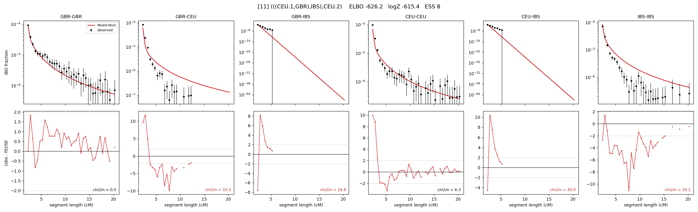

# `(((CEU.1,GBR),IBS),CEU.2)`

Model 11 of 21 | admixed leaf: **CEU** | 4 events, 8 nodes

## Model score

| quantity | value | |
|---|---|---|
| ELBO | -626.18 | +- 0.16 (MC) |
| logZ (importance sampling) | -615.35 | |
| ESS of the IS weights | 7.7 / 4000 | LOW -- treat logZ with suspicion |
| Stan dropped-constant correction | -25.77 | already applied |
| seed kept / runtime | 1 | 24 s |

## Events (in temporal order, most recent first)

| # | type | detail | time (gen) | cumulative |
|---|---|---|---|---|
| 1 | ADMIXTURE | CEU -> CEU.1 + CEU.2 | 1.0 +- 0.0 | 1.0 |
| 2 | MERGE | CEU.2 + GBR -> n1 | 1.0 +- 0.0 | 2.0 |
| 3 | MERGE | n1 + IBS -> n2 | 267.9 +- 1.0 | 269.9 |
| 4 | MERGE | CEU.1 + n2 -> root | 3.3 +- 0.0 | 273.2 |

## Admixture fraction

**f = 0.731 +- 0.012** (fraction from `CEU.1`; 0.269 from `CEU.2`)

## Effective sizes (haploid)

| node | Ne | sd of log Ne |
|---|---|---|
| `GBR` | 222,267 | 0.09 |
| `CEU` | 271,461 | 0.05 |
| `IBS` | 282,243 | 0.04 |
| `CEU.1` | 308,052 | 0.09 |
| `CEU.2` | 228,006 | 0.09 |
| `n1` | 233,496 | 0.09 |
| `n2` | 9,374 | 0.07 |
| `root` | 83 | 0.03 |

log-Ne random-walk step scale tau = 2.804

## Fit quality by component

| component | log-likelihood | n terms | chi2/n |
|---|---|---|---|
| IBD | +799.8 | 132 | 13.56 |
| SNP | -1,134.8 | 6 | 397.54 |

chi2/n is the mean squared standardized residual: 1.0 = fits inside its own SEs. Do NOT compare the two log-likelihood LEVELS against each other -- different term counts and different units.

## SNP covariance residuals `(w_hat - W_pred)/w_se`

| | GBR | CEU | IBS |
|---|---|---|---|
| **GBR** | +2.62 | +25.71 | -23.31 |
| **CEU** | +25.71 | +4.44 | -19.86 |
| **IBS** | -23.31 | -19.86 | +27.45 |

