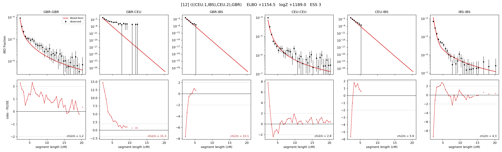

# `(((CEU.1,IBS),CEU.2),GBR)`

Model 12 of 21 | admixed leaf: **CEU** | 4 events, 8 nodes

## Model score

| quantity | value | |
|---|---|---|
| ELBO | +1154.50 | +- 0.58 (MC) |
| logZ (importance sampling) | +1188.97 | |
| ESS of the IS weights | 2.8 / 4000 | LOW -- treat logZ with suspicion |
| Stan dropped-constant correction | -25.77 | already applied |
| seed kept / runtime | 47 | 22 s |

## Events (in temporal order, most recent first)

| # | type | detail | time (gen) | cumulative |
|---|---|---|---|---|
| 1 | ADMIXTURE | CEU -> CEU.1 + CEU.2 | 40.7 +- 3.1 | 40.7 |
| 2 | MERGE | CEU.2 + IBS -> n1 | 98.7 +- 2.9 | 139.4 |
| 3 | MERGE | CEU.1 + n1 -> n2 | 8.1 +- 0.9 | 147.6 |
| 4 | MERGE | n2 + GBR -> root | 1.1 +- 0.0 | 148.6 |

## Admixture fraction

**f = 0.997 +- 0.001** (fraction from `CEU.1`; 0.003 from `CEU.2`)

Collapsed to a tree: one source carries <5% of the ancestry, so this graph is behaving as its no-admixture special case.

## Effective sizes (haploid)

| node | Ne | sd of log Ne |
|---|---|---|
| `GBR` | 308,167 | 0.13 |
| `CEU` | 997,397 | 0.33 |
| `IBS` | 1,030,762 | 0.16 |
| `CEU.1` | 303,809 | 0.12 |
| `CEU.2` | 1,892 | 0.73 |
| `n1` | 2,232 | 0.14 |
| `n2` | 11,508 | 0.07 |
| `root` | 8,257 | 0.04 |

log-Ne random-walk step scale tau = 1.675

## Fit quality by component

| component | log-likelihood | n terms | chi2/n |
|---|---|---|---|
| IBD | +1,271.0 | 132 | 7.43 |
| SNP | +3.9 | 6 | 17.96 |

chi2/n is the mean squared standardized residual: 1.0 = fits inside its own SEs. Do NOT compare the two log-likelihood LEVELS against each other -- different term counts and different units.

## SNP covariance residuals `(w_hat - W_pred)/w_se`

| | GBR | CEU | IBS |
|---|---|---|---|
| **GBR** | -3.96 | +6.71 | -1.21 |
| **CEU** | +6.71 | -4.31 | -0.36 |
| **IBS** | -1.21 | -0.36 | +0.94 |

