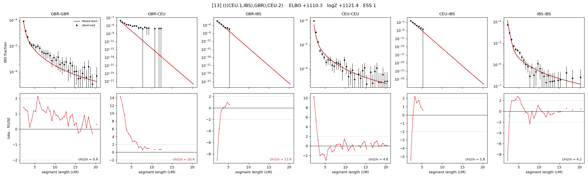

# `(((CEU.1,IBS),GBR),CEU.2)`

Model 13 of 21 | admixed leaf: **CEU** | 4 events, 8 nodes

## Model score

| quantity | value | |
|---|---|---|
| ELBO | +1110.25 | +- 0.12 (MC) |
| logZ (importance sampling) | +1121.38 | |
| ESS of the IS weights | 1.5 / 4000 | LOW -- treat logZ with suspicion |
| Stan dropped-constant correction | -25.77 | already applied |
| seed kept / runtime | 1 | 24 s |

## Events (in temporal order, most recent first)

| # | type | detail | time (gen) | cumulative |
|---|---|---|---|---|
| 1 | ADMIXTURE | CEU -> CEU.1 + CEU.2 | 1.0 +- 0.0 | 1.0 |
| 2 | MERGE | CEU.2 + IBS -> n1 | 139.0 +- 0.6 | 140.0 |
| 3 | MERGE | n1 + GBR -> n2 | 10.1 +- 0.2 | 150.1 |
| 4 | MERGE | CEU.1 + n2 -> root | 1.0 +- 0.0 | 151.1 |

## Admixture fraction

**f = 0.997 +- 0.000** (fraction from `CEU.1`; 0.003 from `CEU.2`)

Collapsed to a tree: one source carries <5% of the ancestry, so this graph is behaving as its no-admixture special case.

## Effective sizes (haploid)

| node | Ne | sd of log Ne |
|---|---|---|
| `GBR` | 285,726 | 0.11 |
| `CEU` | 469,476 | 0.08 |
| `IBS` | 1,000,981 | 0.14 |
| `CEU.1` | 514,685 | 0.08 |
| `CEU.2` | 1,690 | 0.11 |
| `n1` | 2,757 | 0.03 |
| `n2` | 13,158 | 0.03 |
| `root` | 7,466 | 0.03 |

log-Ne random-walk step scale tau = 1.653

## Fit quality by component

| component | log-likelihood | n terms | chi2/n |
|---|---|---|---|
| IBD | +1,247.7 | 132 | 7.75 |
| SNP | +25.1 | 6 | 10.91 |

chi2/n is the mean squared standardized residual: 1.0 = fits inside its own SEs. Do NOT compare the two log-likelihood LEVELS against each other -- different term counts and different units.

## SNP covariance residuals `(w_hat - W_pred)/w_se`

| | GBR | CEU | IBS |
|---|---|---|---|
| **GBR** | -3.01 | +5.58 | -1.30 |
| **CEU** | +5.58 | -3.71 | -0.19 |
| **IBS** | -1.30 | -0.19 | +0.87 |

