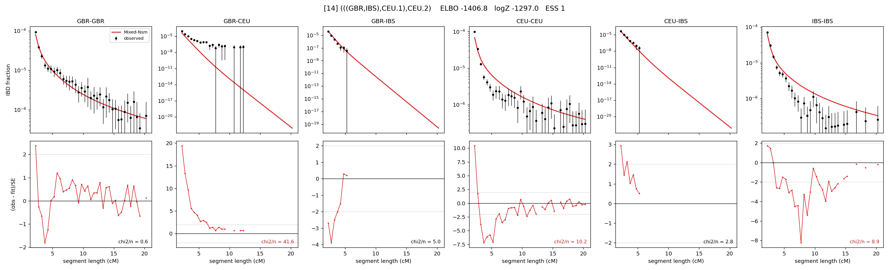

# `(((GBR,IBS),CEU.1),CEU.2)`

Model 14 of 21 | admixed leaf: **CEU** | 4 events, 8 nodes

> Graph where the two NON-admixed leaves merge first. Excluded by the 'first merge must involve an admixture branch' rule; included here because it is the standard local-clade + deep-source scenario.

## Model score

| quantity | value | |
|---|---|---|
| ELBO | -1406.79 | +- 0.80 (MC) |
| logZ (importance sampling) | -1297.05 | |
| ESS of the IS weights | 1.0 / 4000 | LOW -- treat logZ with suspicion |
| Stan dropped-constant correction | -25.77 | already applied |
| seed kept / runtime | 47 | 25 s |

## Events (in temporal order, most recent first)

| # | type | detail | time (gen) | cumulative |
|---|---|---|---|---|
| 1 | ADMIXTURE | CEU -> CEU.1 + CEU.2 | 1.0 +- 0.0 | 1.0 |
| 2 | MERGE | GBR + IBS -> n1 | 90.4 +- 1.6 | 91.4 |
| 3 | MERGE | CEU.2 + n1 -> n2 | 11.6 +- 0.1 | 103.0 |
| 4 | MERGE | CEU.1 + n2 -> root | 35.4 +- 1.1 | 138.5 |

## Admixture fraction

**f = 0.723 +- 0.010** (fraction from `CEU.1`; 0.277 from `CEU.2`)

## Effective sizes (haploid)

| node | Ne | sd of log Ne |
|---|---|---|
| `GBR` | 206,583 | 0.10 |
| `CEU` | 202,673 | 0.05 |
| `IBS` | 369,504 | 0.09 |
| `CEU.1` | 174,518 | 0.06 |
| `CEU.2` | 326,808 | 0.10 |
| `n1` | 361,951 | 0.07 |
| `n2` | 365,944 | 0.07 |
| `root` | 14,834 | 0.02 |

log-Ne random-walk step scale tau = 2.161

## Fit quality by component

| component | log-likelihood | n terms | chi2/n |
|---|---|---|---|
| IBD | +1,011.6 | 132 | 11.10 |
| SNP | -2,283.6 | 6 | 780.48 |

chi2/n is the mean squared standardized residual: 1.0 = fits inside its own SEs. Do NOT compare the two log-likelihood LEVELS against each other -- different term counts and different units.

## SNP covariance residuals `(w_hat - W_pred)/w_se`

| | GBR | CEU | IBS |
|---|---|---|---|
| **GBR** | +14.47 | +27.98 | -37.54 |
| **CEU** | +27.98 | +9.07 | -25.35 |
| **IBS** | -37.54 | -25.35 | +39.41 |

