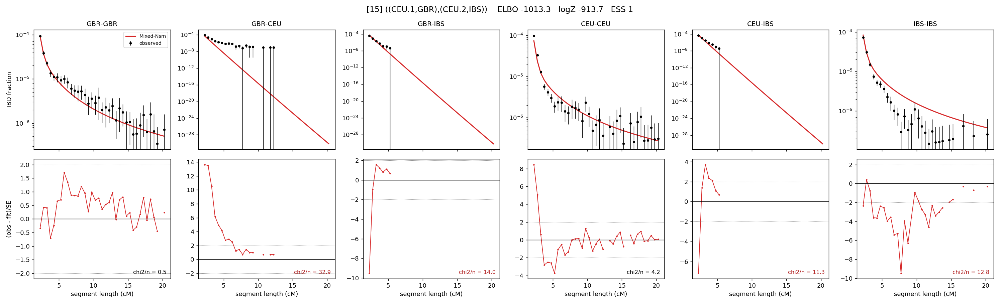

# `((CEU.1,GBR),(CEU.2,IBS))`

Model 15 of 21 | admixed leaf: **CEU** | 4 events, 8 nodes

## Model score

| quantity | value | |
|---|---|---|
| ELBO | -1013.34 | +- 2.19 (MC) |
| logZ (importance sampling) | -913.67 | |
| ESS of the IS weights | 1.0 / 4000 | LOW -- treat logZ with suspicion |
| Stan dropped-constant correction | -25.77 | already applied |
| seed kept / runtime | 1 | 24 s |

## Events (in temporal order, most recent first)

| # | type | detail | time (gen) | cumulative |
|---|---|---|---|---|
| 1 | ADMIXTURE | CEU -> CEU.1 + CEU.2 | 1.0 +- 0.0 | 1.0 |
| 2 | MERGE | CEU.1 + GBR -> n1 | 166.2 +- 4.7 | 167.2 |
| 3 | MERGE | CEU.2 + IBS -> n2 | 1.0 +- 0.0 | 168.2 |
| 4 | MERGE | n1 + n2 -> root | 1.0 +- 0.0 | 169.3 |

## Admixture fraction

**f = 0.000 +- 0.000** (fraction from `CEU.1`; 1.000 from `CEU.2`)

Collapsed to a tree: one source carries <5% of the ancestry, so this graph is behaving as its no-admixture special case.

## Effective sizes (haploid)

| node | Ne | sd of log Ne |
|---|---|---|
| `GBR` | 247,951 | 0.17 |
| `CEU` | 456,821 | 0.35 |
| `IBS` | 333,140 | 0.17 |
| `CEU.1` | 5,702 | 0.31 |
| `CEU.2` | 508,954 | 0.34 |
| `n1` | 8,444 | 0.11 |
| `n2` | 6,964 | 0.14 |
| `root` | 4,037 | 0.16 |

log-Ne random-walk step scale tau = 1.220

## Fit quality by component

| component | log-likelihood | n terms | chi2/n |
|---|---|---|---|
| IBD | +1,018.0 | 132 | 11.02 |
| SNP | -1,877.2 | 6 | 645.00 |

chi2/n is the mean squared standardized residual: 1.0 = fits inside its own SEs. Do NOT compare the two log-likelihood LEVELS against each other -- different term counts and different units.

## SNP covariance residuals `(w_hat - W_pred)/w_se`

| | GBR | CEU | IBS |
|---|---|---|---|
| **GBR** | +2.06 | +32.25 | -27.95 |
| **CEU** | +32.25 | +7.83 | -26.90 |
| **IBS** | -27.95 | -26.90 | +35.15 |

