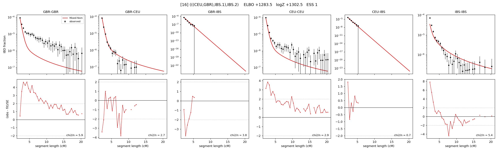

# `(((CEU,GBR),IBS.1),IBS.2)`

Model 16 of 21 | admixed leaf: **IBS** | 4 events, 8 nodes

> Graph where the two NON-admixed leaves merge first. Excluded by the 'first merge must involve an admixture branch' rule; included here because it is the standard local-clade + deep-source scenario.

## Model score

| quantity | value | |
|---|---|---|
| ELBO | +1283.50 | +- 0.34 (MC) |
| logZ (importance sampling) | +1302.54 | |
| ESS of the IS weights | 1.3 / 4000 | LOW -- treat logZ with suspicion |
| Stan dropped-constant correction | -25.77 | already applied |
| seed kept / runtime | 13 | 24 s |

## Events (in temporal order, most recent first)

| # | type | detail | time (gen) | cumulative |
|---|---|---|---|---|
| 1 | ADMIXTURE | IBS -> IBS.1 + IBS.2 | 1.0 +- 0.0 | 1.0 |
| 2 | MERGE | GBR + CEU -> n1 | 1.0 +- 0.0 | 2.0 |
| 3 | MERGE | IBS.2 + n1 -> n2 | 122.8 +- 1.0 | 124.8 |
| 4 | MERGE | IBS.1 + n2 -> root | 133.8 +- 1.1 | 258.5 |

## Admixture fraction

**f = 0.532 +- 0.018** (fraction from `IBS.1`; 0.468 from `IBS.2`)

## Effective sizes (haploid)

| node | Ne | sd of log Ne |
|---|---|---|
| `GBR` | 1,945,732 | 0.11 |
| `CEU` | 1,862,969 | 0.11 |
| `IBS` | 326,379 | 0.25 |
| `IBS.1` | 301,339 | 0.20 |
| `IBS.2` | 385,637 | 0.33 |
| `n1` | 2,053,312 | 0.11 |
| `n2` | 10,068 | 0.04 |
| `root` | 13,755 | 0.02 |

log-Ne random-walk step scale tau = 1.327

## Fit quality by component

| component | log-likelihood | n terms | chi2/n |
|---|---|---|---|
| IBD | +1,450.7 | 132 | 4.38 |
| SNP | -4.8 | 6 | 20.86 |

chi2/n is the mean squared standardized residual: 1.0 = fits inside its own SEs. Do NOT compare the two log-likelihood LEVELS against each other -- different term counts and different units.

## SNP covariance residuals `(w_hat - W_pred)/w_se`

| | GBR | CEU | IBS |
|---|---|---|---|
| **GBR** | +7.10 | -7.45 | -1.49 |
| **CEU** | -7.45 | +3.28 | +1.73 |
| **IBS** | -1.49 | +1.73 | -0.42 |

