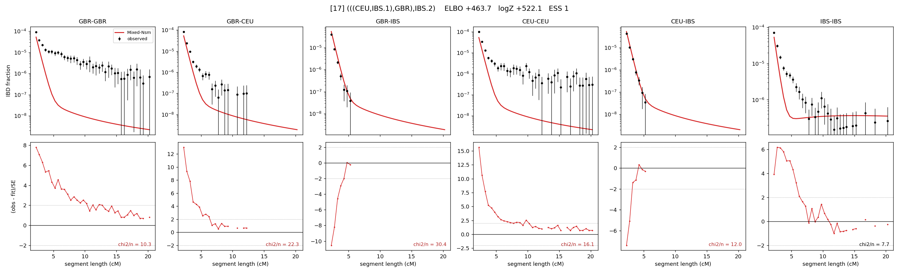

# `(((CEU,IBS.1),GBR),IBS.2)`

Model 17 of 21 | admixed leaf: **IBS** | 4 events, 8 nodes

## Model score

| quantity | value | |
|---|---|---|
| ELBO | +463.75 | +- 1.70 (MC) |
| logZ (importance sampling) | +522.07 | |
| ESS of the IS weights | 1.1 / 4000 | LOW -- treat logZ with suspicion |
| Stan dropped-constant correction | -25.77 | already applied |
| seed kept / runtime | 23 | 25 s |

## Events (in temporal order, most recent first)

| # | type | detail | time (gen) | cumulative |
|---|---|---|---|---|
| 1 | ADMIXTURE | IBS -> IBS.1 + IBS.2 | 1.0 +- 0.0 | 1.0 |
| 2 | MERGE | IBS.2 + CEU -> n1 | 1.0 +- 0.0 | 2.0 |
| 3 | MERGE | n1 + GBR -> n2 | 1.0 +- 0.0 | 3.0 |
| 4 | MERGE | IBS.1 + n2 -> root | 127.1 +- 1.6 | 130.1 |

## Admixture fraction

**f = 0.007 +- 0.001** (fraction from `IBS.1`; 0.993 from `IBS.2`)

Collapsed to a tree: one source carries <5% of the ancestry, so this graph is behaving as its no-admixture special case.

## Effective sizes (haploid)

| node | Ne | sd of log Ne |
|---|---|---|
| `GBR` | 172,590,328 | 1.03 |
| `CEU` | 164,117,493 | 1.03 |
| `IBS` | 147,938,797 | 1.02 |
| `IBS.1` | 1 | 0.16 |
| `IBS.2` | 173,492,605 | 1.03 |
| `n1` | 175,857,806 | 1.03 |
| `n2` | 185,755,920 | 1.03 |
| `root` | 13,905 | 0.07 |

log-Ne random-walk step scale tau = 2.013

## Fit quality by component

| component | log-likelihood | n terms | chi2/n |
|---|---|---|---|
| IBD | +801.7 | 132 | 14.37 |
| SNP | -28.8 | 6 | 28.86 |

chi2/n is the mean squared standardized residual: 1.0 = fits inside its own SEs. Do NOT compare the two log-likelihood LEVELS against each other -- different term counts and different units.

## SNP covariance residuals `(w_hat - W_pred)/w_se`

| | GBR | CEU | IBS |
|---|---|---|---|
| **GBR** | +7.12 | -7.48 | -1.48 |
| **CEU** | -7.48 | +3.30 | +1.73 |
| **IBS** | -1.48 | +1.73 | -0.42 |

