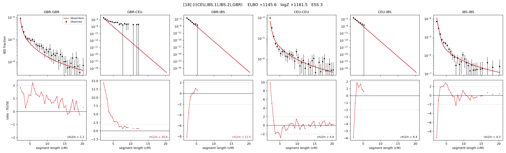

# `(((CEU,IBS.1),IBS.2),GBR)`

Model 18 of 21 | admixed leaf: **IBS** | 4 events, 8 nodes

## Model score

| quantity | value | |
|---|---|---|
| ELBO | +1145.57 | +- 0.24 (MC) |
| logZ (importance sampling) | +1161.48 | |
| ESS of the IS weights | 2.9 / 4000 | LOW -- treat logZ with suspicion |
| Stan dropped-constant correction | -25.77 | already applied |
| seed kept / runtime | 47 | 20 s |

## Events (in temporal order, most recent first)

| # | type | detail | time (gen) | cumulative |
|---|---|---|---|---|
| 1 | ADMIXTURE | IBS -> IBS.1 + IBS.2 | 139.4 +- 1.0 | 139.4 |
| 2 | MERGE | IBS.2 + CEU -> n1 | 7.4 +- 0.1 | 146.8 |
| 3 | MERGE | IBS.1 + n1 -> n2 | 1.1 +- 0.1 | 148.0 |
| 4 | MERGE | n2 + GBR -> root | 1.1 +- 0.0 | 149.0 |

## Admixture fraction

**f = 0.963 +- 0.013** (fraction from `IBS.1`; 0.037 from `IBS.2`)

Collapsed to a tree: one source carries <5% of the ancestry, so this graph is behaving as its no-admixture special case.

## Effective sizes (haploid)

| node | Ne | sd of log Ne |
|---|---|---|
| `GBR` | 295,830 | 0.13 |
| `CEU` | 522,514 | 0.08 |
| `IBS` | 1,041,648 | 0.20 |
| `IBS.1` | 2,179 | 0.04 |
| `IBS.2` | 22,080 | 0.20 |
| `n1` | 20,586 | 0.15 |
| `n2` | 13,927 | 0.05 |
| `root` | 8,017 | 0.03 |

log-Ne random-walk step scale tau = 1.729

## Fit quality by component

| component | log-likelihood | n terms | chi2/n |
|---|---|---|---|
| IBD | +1,255.6 | 132 | 7.63 |
| SNP | +19.7 | 6 | 12.71 |

chi2/n is the mean squared standardized residual: 1.0 = fits inside its own SEs. Do NOT compare the two log-likelihood LEVELS against each other -- different term counts and different units.

## SNP covariance residuals `(w_hat - W_pred)/w_se`

| | GBR | CEU | IBS |
|---|---|---|---|
| **GBR** | -3.66 | +5.99 | -0.95 |
| **CEU** | +5.99 | -3.42 | -0.71 |
| **IBS** | -0.95 | -0.71 | +1.05 |

