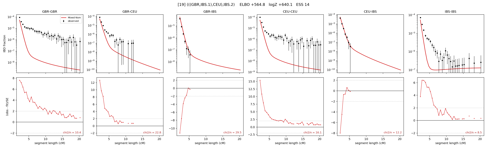

# `(((GBR,IBS.1),CEU),IBS.2)`

Model 19 of 21 | admixed leaf: **IBS** | 4 events, 8 nodes

## Model score

| quantity | value | |
|---|---|---|
| ELBO | +564.82 | +- 1.55 (MC) |
| logZ (importance sampling) | +640.07 | |
| ESS of the IS weights | 13.5 / 4000 | LOW -- treat logZ with suspicion |
| Stan dropped-constant correction | -25.77 | already applied |
| seed kept / runtime | 23 | 24 s |

## Events (in temporal order, most recent first)

| # | type | detail | time (gen) | cumulative |
|---|---|---|---|---|
| 1 | ADMIXTURE | IBS -> IBS.1 + IBS.2 | 1.0 +- 0.0 | 1.0 |
| 2 | MERGE | IBS.2 + GBR -> n1 | 1.1 +- 0.0 | 2.1 |
| 3 | MERGE | n1 + CEU -> n2 | 25.0 +- 5.6 | 27.1 |
| 4 | MERGE | IBS.1 + n2 -> root | 108.1 +- 10.4 | 135.2 |

## Admixture fraction

**f = 0.005 +- 0.000** (fraction from `IBS.1`; 0.995 from `IBS.2`)

Collapsed to a tree: one source carries <5% of the ancestry, so this graph is behaving as its no-admixture special case.

## Effective sizes (haploid)

| node | Ne | sd of log Ne |
|---|---|---|
| `GBR` | 117,691,374 | 0.79 |
| `CEU` | 208,798,890 | 0.93 |
| `IBS` | 111,076,349 | 0.79 |
| `IBS.1` | 1 | 0.20 |
| `IBS.2` | 110,962,207 | 0.78 |
| `n1` | 105,482,179 | 0.77 |
| `n2` | 57,960,522 | 0.63 |
| `root` | 11,914 | 0.22 |

log-Ne random-walk step scale tau = 1.107

## Fit quality by component

| component | log-likelihood | n terms | chi2/n |
|---|---|---|---|
| IBD | +793.5 | 132 | 14.66 |
| SNP | -55.3 | 6 | 37.69 |

chi2/n is the mean squared standardized residual: 1.0 = fits inside its own SEs. Do NOT compare the two log-likelihood LEVELS against each other -- different term counts and different units.

## SNP covariance residuals `(w_hat - W_pred)/w_se`

| | GBR | CEU | IBS |
|---|---|---|---|
| **GBR** | +6.88 | -7.79 | -0.99 |
| **CEU** | -7.79 | +3.07 | +2.12 |
| **IBS** | -0.99 | +2.12 | -0.98 |

