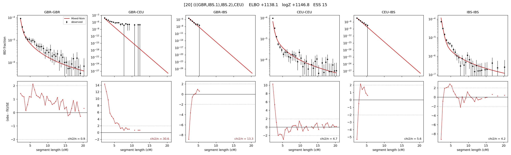

# `(((GBR,IBS.1),IBS.2),CEU)`

Model 20 of 21 | admixed leaf: **IBS** | 4 events, 8 nodes

## Model score

| quantity | value | |
|---|---|---|
| ELBO | +1138.06 | +- 0.12 (MC) |
| logZ (importance sampling) | +1146.85 | |
| ESS of the IS weights | 14.9 / 4000 | LOW -- treat logZ with suspicion |
| Stan dropped-constant correction | -25.77 | already applied |
| seed kept / runtime | 7 | 22 s |

## Events (in temporal order, most recent first)

| # | type | detail | time (gen) | cumulative |
|---|---|---|---|---|
| 1 | ADMIXTURE | IBS -> IBS.1 + IBS.2 | 139.1 +- 0.8 | 139.1 |
| 2 | MERGE | IBS.2 + GBR -> n1 | 5.2 +- 0.1 | 144.3 |
| 3 | MERGE | IBS.1 + n1 -> n2 | 4.7 +- 0.1 | 149.0 |
| 4 | MERGE | n2 + CEU -> root | 1.1 +- 0.0 | 150.1 |

## Admixture fraction

**f = 0.976 +- 0.008** (fraction from `IBS.1`; 0.024 from `IBS.2`)

Collapsed to a tree: one source carries <5% of the ancestry, so this graph is behaving as its no-admixture special case.

## Effective sizes (haploid)

| node | Ne | sd of log Ne |
|---|---|---|
| `GBR` | 285,159 | 0.09 |
| `CEU` | 517,054 | 0.10 |
| `IBS` | 1,039,749 | 0.15 |
| `IBS.1` | 2,580 | 0.03 |
| `IBS.2` | 106,043 | 0.05 |
| `n1` | 106,045 | 0.05 |
| `n2` | 21,895 | 0.03 |
| `root` | 7,710 | 0.03 |

log-Ne random-walk step scale tau = 2.177

## Fit quality by component

| component | log-likelihood | n terms | chi2/n |
|---|---|---|---|
| IBD | +1,249.7 | 132 | 7.72 |
| SNP | +26.3 | 6 | 10.50 |

chi2/n is the mean squared standardized residual: 1.0 = fits inside its own SEs. Do NOT compare the two log-likelihood LEVELS against each other -- different term counts and different units.

## SNP covariance residuals `(w_hat - W_pred)/w_se`

| | GBR | CEU | IBS |
|---|---|---|---|
| **GBR** | -3.01 | +5.63 | -1.35 |
| **CEU** | +5.63 | -3.38 | -0.51 |
| **IBS** | -1.35 | -0.51 | +1.13 |

