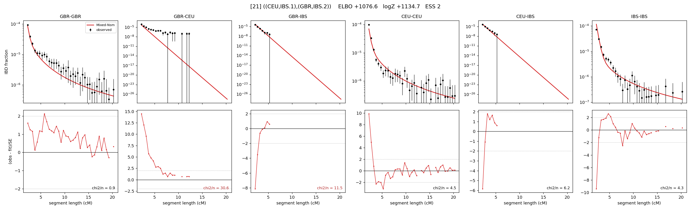

# `((CEU,IBS.1),(GBR,IBS.2))`

Model 21 of 21 | admixed leaf: **IBS** | 4 events, 8 nodes

## Model score

| quantity | value | |
|---|---|---|
| ELBO | +1076.57 | +- 1.55 (MC) |
| logZ (importance sampling) | +1134.67 | |
| ESS of the IS weights | 1.6 / 4000 | LOW -- treat logZ with suspicion |
| Stan dropped-constant correction | -25.77 | already applied |
| seed kept / runtime | 31 | 23 s |

## Events (in temporal order, most recent first)

| # | type | detail | time (gen) | cumulative |
|---|---|---|---|---|
| 1 | ADMIXTURE | IBS -> IBS.1 + IBS.2 | 140.4 +- 1.5 | 140.4 |
| 2 | MERGE | IBS.1 + GBR -> n1 | 1.7 +- 0.2 | 142.1 |
| 3 | MERGE | IBS.2 + CEU -> n2 | 5.4 +- 0.4 | 147.5 |
| 4 | MERGE | n1 + n2 -> root | 1.1 +- 0.0 | 148.6 |

## Admixture fraction

**f = 0.026 +- 0.003** (fraction from `IBS.1`; 0.974 from `IBS.2`)

Collapsed to a tree: one source carries <5% of the ancestry, so this graph is behaving as its no-admixture special case.

## Effective sizes (haploid)

| node | Ne | sd of log Ne |
|---|---|---|
| `GBR` | 310,877 | 0.31 |
| `CEU` | 523,035 | 0.22 |
| `IBS` | 1,074,831 | 0.38 |
| `IBS.1` | 156,546 | 0.15 |
| `IBS.2` | 1,842 | 0.10 |
| `n1` | 155,835 | 0.15 |
| `n2` | 13,494 | 0.04 |
| `root` | 8,159 | 0.03 |

log-Ne random-walk step scale tau = 2.047

## Fit quality by component

| component | log-likelihood | n terms | chi2/n |
|---|---|---|---|
| IBD | +1,223.4 | 132 | 8.11 |
| SNP | +10.6 | 6 | 15.73 |

chi2/n is the mean squared standardized residual: 1.0 = fits inside its own SEs. Do NOT compare the two log-likelihood LEVELS against each other -- different term counts and different units.

## SNP covariance residuals `(w_hat - W_pred)/w_se`

| | GBR | CEU | IBS |
|---|---|---|---|
| **GBR** | -4.21 | +5.84 | -0.26 |
| **CEU** | +5.84 | -2.99 | -0.98 |
| **IBS** | -0.26 | -0.98 | +0.86 |

