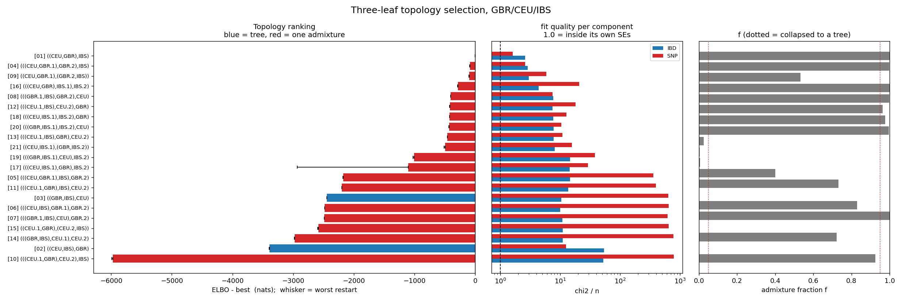

# Topology selection on GBR / CEU / IBS

21 models (3 trees + 18 one-admixture graphs), `mixed_model_Nsmooth`, Pathfinder with 6+ seeds, best ELBO kept.

## Ranking

| rank | topology | adm | ELBO | dELBO | restart range | ESS | chi2/n IBD | chi2/n SNP | f | P_model | P_argmax |
|---|---|---|---|---|---|---|---|---|---|---|---|
| 1 | [`((CEU,GBR),IBS)`](../01_((CEU,GBR),IBS)/report.md) | 0 | +1568.6 | +0.0 | 0.5 | 17.8 | 2.61 | 1.60 | - | 1.000 | 1.000 |
| 2 | [`(((CEU,GBR.1),GBR.2),IBS)`](../04_(((CEU,GBR.1),GBR.2),IBS)/report.md) | 1 | +1482.7 | -85.8 | 3.2 | 12.0 | 2.85 | 2.61 | 1.000 | 0.000 | 0.000 |
| 3 | [`((CEU,GBR.1),(GBR.2,IBS))`](../09_((CEU,GBR.1),(GBR.2,IBS))/report.md) | 1 | +1469.0 | -99.5 | 6.4 | 1.5 | 2.98 | 5.87 | 0.998 | 0.000 | 0.000 |
| 4 | [`(((CEU,GBR),IBS.1),IBS.2)`](../16_(((CEU,GBR),IBS.1),IBS.2)/report.md) | 1 | +1283.5 | -285.1 | 6.8 | 1.3 | 4.38 | 20.86 | 0.532 | 0.000 | 0.000 |
| 5 | [`(((GBR.1,IBS),GBR.2),CEU)`](../08_(((GBR.1,IBS),GBR.2),CEU)/report.md) | 1 | +1163.8 | -404.7 | 2.3 | 3.2 | 7.66 | 7.46 | 0.999 | 0.000 | 0.000 |
| 6 | [`(((CEU.1,IBS),CEU.2),GBR)`](../12_(((CEU.1,IBS),CEU.2),GBR)/report.md) | 1 | +1154.5 | -414.1 | 6.4 | 2.8 | 7.43 | 17.96 | 0.997 | 0.000 | 0.000 |
| 7 | [`(((CEU,IBS.1),IBS.2),GBR)`](../18_(((CEU,IBS.1),IBS.2),GBR)/report.md) | 1 | +1145.6 | -423.0 | 1.9 | 2.9 | 7.63 | 12.71 | 0.963 | 0.000 | 0.000 |
| 8 | [`(((GBR,IBS.1),IBS.2),CEU)`](../20_(((GBR,IBS.1),IBS.2),CEU)/report.md) | 1 | +1138.1 | -430.5 | 1.7 | 14.9 | 7.72 | 10.50 | 0.976 | 0.000 | 0.000 |
| 9 | [`(((CEU.1,IBS),GBR),CEU.2)`](../13_(((CEU.1,IBS),GBR),CEU.2)/report.md) | 1 | +1110.3 | -458.3 | 1.9 | 1.5 | 7.75 | 10.91 | 0.997 | 0.000 | 0.000 |
| 10 | [`((CEU,IBS.1),(GBR,IBS.2))`](../21_((CEU,IBS.1),(GBR,IBS.2))/report.md) | 1 | +1076.6 | -492.0 | 18.3 | 1.6 | 8.11 | 15.73 | 0.026 | 0.000 | 0.000 |
| 11 | [`(((GBR,IBS.1),CEU),IBS.2)`](../19_(((GBR,IBS.1),CEU),IBS.2)/report.md) | 1 | +564.8 | -1003.7 | 22.5 | 13.5 | 14.66 | 37.69 | 0.005 | 0.000 | 0.000 |
| 12 | [`(((CEU,IBS.1),GBR),IBS.2)`](../17_(((CEU,IBS.1),GBR),IBS.2)/report.md) | 1 | +463.7 | -1104.8 | 1826.5 | 1.1 | 14.37 | 28.86 | 0.007 | 0.000 | 0.000 |
| 13 | [`(((CEU,GBR.1),IBS),GBR.2)`](../05_(((CEU,GBR.1),IBS),GBR.2)/report.md) | 1 | -603.1 | -2171.7 | 5.3 | 2.2 | 14.51 | 358.12 | 0.400 | 0.000 | 0.000 |
| 14 | [`(((CEU.1,GBR),IBS),CEU.2)`](../11_(((CEU.1,GBR),IBS),CEU.2)/report.md) | 1 | -626.2 | -2194.7 | 0.3 | 7.7 | 13.56 | 397.54 | 0.731 | 0.000 | 0.000 |
| 15 | [`((GBR,IBS),CEU)`](../03_((GBR,IBS),CEU)/report.md) | 0 | -876.9 | -2445.4 | 0.7 | 1.4 | 10.40 | 637.45 | - | 0.000 | 0.000 |
| 16 | [`(((CEU,IBS),GBR.1),GBR.2)`](../06_(((CEU,IBS),GBR.1),GBR.2)/report.md) | 1 | -911.6 | -2480.1 | 3.2 | 3.8 | 10.02 | 643.83 | 0.829 | 0.000 | 0.000 |
| 17 | [`(((GBR.1,IBS),CEU),GBR.2)`](../07_(((GBR.1,IBS),CEU),GBR.2)/report.md) | 1 | -916.1 | -2484.6 | 2.3 | 2.8 | 10.81 | 621.20 | 1.000 | 0.000 | 0.000 |
| 18 | [`((CEU.1,GBR),(CEU.2,IBS))`](../15_((CEU.1,GBR),(CEU.2,IBS))/report.md) | 1 | -1013.3 | -2581.9 | 14.9 | 1.0 | 11.02 | 645.00 | 0.000 | 0.000 | 0.000 |
| 19 | [`(((GBR,IBS),CEU.1),CEU.2)`](../14_(((GBR,IBS),CEU.1),CEU.2)/report.md) | 1 | -1406.8 | -2975.3 | 3.7 | 1.0 | 11.10 | 780.48 | 0.723 | 0.000 | 0.000 |
| 20 | [`((CEU,IBS),GBR)`](../02_((CEU,IBS),GBR)/report.md) | 0 | -1821.4 | -3390.0 | 7.6 | 27.3 | 53.56 | 12.54 | - | 0.000 | 0.000 |
| 21 | [`(((CEU.1,GBR),CEU.2),IBS)`](../10_(((CEU.1,GBR),CEU.2),IBS)/report.md) | 1 | -4405.0 | -5973.6 | 15.4 | 2.0 | 52.05 | 785.20 | 0.924 | 0.000 | 0.000 |

## Selection

- **Best model: `((CEU,GBR),IBS)`**, ELBO +1568.6, P_model = 1.000, P_argmax = 1.000.
- Runner-up `(((CEU,GBR.1),GBR.2),IBS)` is -85.8 nats behind. The winner's 6 restarts span 0.5 nats, and **6 of them beat the runner-up's best restart** -- the lead does not depend on the restart budget.
- Best tree `((CEU,GBR),IBS)` vs best admixture graph `(((CEU,GBR.1),GBR.2),IBS)`: -85.8 nats for 3 extra Ne, 2 extra times and 1 fraction.

## How to read the two probabilities

`P_model` is softmax over the 21 ELBOs with a uniform model prior -- the posterior model probability. `P_argmax` bootstraps the Pathfinder draws and counts how often each model wins, so it measures only whether the RANKING is stable against Monte Carlo error. Both saturate at 1.000/0.000 whenever the gaps exceed a few nats, which they do here; the informative number is dELBO.

## Caveats that travel with these numbers

1. The ELBO is a lower bound on log Z and the gap KL(q||p) differs per model, so a model whose posterior happens to be more Gaussian is rewarded for that alone. The importance-sampling `logZ` would correct it, but the ESS column shows the weights are degenerate (max ESS 27 of 4000), so `logZ` cannot be trusted here either.
2. An admixture graph splits the admixed leaf into two source branches with separate Ne -- it buys a piecewise Ne, which these data independently want. A win by an admixture graph is evidence for non-constant Ne at least as much as for admixture, and three leaves cannot separate the two. Check each folder's residual row for a monotone tilt before reading any result as admixture.
3. These probabilities are conditional on the 21 listed models being the whole hypothesis space. Two admixture events, and non-constant Ne without admixture, are not in it.
