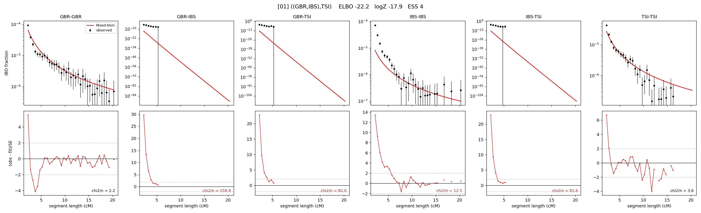

# `((GBR,IBS),TSI)`

Model 01 of 21 | tree (no admixture) | 2 events, 5 nodes

## Model score

| quantity | value | |
|---|---|---|
| ELBO | -22.24 | +- 0.08 (MC) |
| logZ (importance sampling) | -17.86 | |
| ESS of the IS weights | 3.8 / 4000 | LOW -- treat logZ with suspicion |
| Stan dropped-constant correction | -13.81 | already applied |
| seed kept / runtime | 1 | 9 s |

## Events (in temporal order, most recent first)

| # | type | detail | time (gen) | cumulative |
|---|---|---|---|---|
| 1 | MERGE | GBR + IBS -> n1 | 605.9 +- 17.7 | 605.9 |
| 2 | MERGE | n1 + TSI -> root | 77.4 +- 13.0 | 683.3 |

## Effective sizes (haploid)

| node | Ne | sd of log Ne |
|---|---|---|
| `GBR` | 154,610 | 0.03 |
| `IBS` | 1,233,107 | 0.09 |
| `TSI` | 369,466 | 0.04 |
| `n1` | 87,036 | 0.17 |
| `root` | 43,459 | 0.11 |

log-Ne random-walk step scale tau = 0.724

## Fit quality by component

| component | log-likelihood | n terms | chi2/n |
|---|---|---|---|
| IBD | +13.0 | 113 | 26.06 |
| SNP | +17.5 | 6 | 13.14 |

chi2/n is the mean squared standardized residual: 1.0 = fits inside its own SEs. Do NOT compare the two log-likelihood LEVELS against each other -- different term counts and different units.

## SNP covariance residuals `(w_hat - W_pred)/w_se`

| | GBR | IBS | TSI |
|---|---|---|---|
| **GBR** | +2.76 | +1.87 | -4.41 |
| **IBS** | +1.87 | -4.89 | +3.58 |
| **TSI** | -4.41 | +3.58 | +2.58 |

